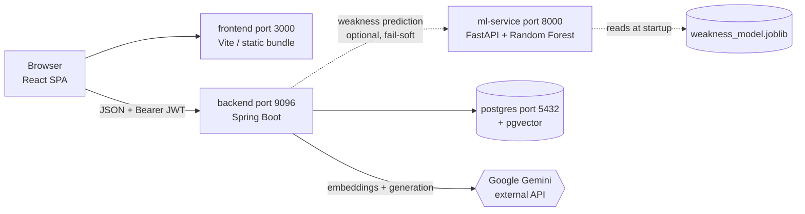
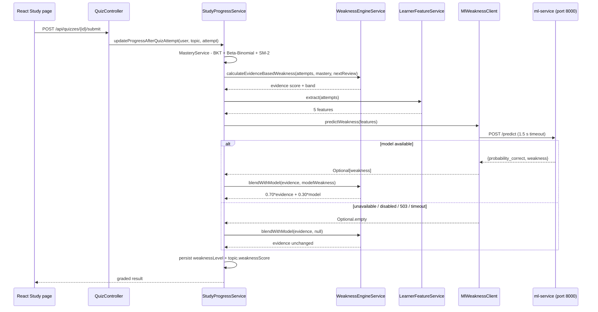

# Architecture — Adaptive Knowledge-Tracing and RAG Recommendation Algorithm

The system combines two coupled loops:

1. **Content loop (RAG)** — grounded question answering and quizzes.
2. **Learner loop (Knowledge Tracing)** — every answer updates mastery,
   forgetting risk, and topic priority, which reshapes the study plan.

## What the project is

AASA (**A**daptive **A**I **S**tudy **A**rchitect) turns one course PDF into an
adaptive study programme. The student uploads a lecture PDF plus an exam date;
the system extracts topics, generates MCQ quizzes, indexes every passage for
cited question-answering, and rebuilds a personalised plan after every answer.

Core contribution — **Adaptive Knowledge-Tracing and RAG Recommendation**:
study priorities come from measured learner evidence (Bayesian Knowledge
Tracing + an exponential forgetting curve), never from manual ratings; and
answers come only from the student's own document through retrieval-augmented
generation with mandatory `[Source N]` citations.

Weakness scoring is **hybrid**: the deterministic evidence formula is corrected
by a supervised Random Forest trained on ~283k real practice opportunities
(ASSISTments), combined as `0.70 · evidence + 0.30 · (1 − P(correct))`. The
model runs as its own service and the blend is **fail-soft** — if it is
unavailable the system scores from evidence alone and stays fully usable.

## The problem it solves

A student two weeks from an exam has a 60-page lecture PDF and no idea where to
start. The tools available to them each fail in a specific way:

| What they'd otherwise do | Why it falls short |
|---|---|
| Re-read the PDF start to finish | Time spent is spread evenly over material they already know and material they don't |
| Make their own flashcards / plan | The plan is built from a *guess* about their own weak spots — and self-assessment is famously unreliable |
| Ask ChatGPT about the subject | Answers come from the model's general knowledge, not their lecturer's actual material, and can't be traced to a page |
| Generic study-planner apps | Ask the student to rate each topic's difficulty by hand, then never revisit that rating as they learn |

The common failure is that **the plan never reacts to evidence**. AASA's premise
is that the study plan should be derived from what the student demonstrably
knows — measured from their answers — and that every explanation should be
traceable to their own document.

## Who it's for

A university or college student revising for a specific exam from a specific set
of lecture notes, working alone. Single-user by design: there is no classroom
view, no instructor dashboard, and no sharing between accounts. An `ADMIN` role
exists purely for database inspection during development.

## What a student actually does

The whole product in one pass, with the route each step lives on:

1. **Register** (`/register`) → an OTP arrives by e-mail → **verify** (`/verify-email`).
   Google sign-in is an alternative that skips the OTP.
2. **Upload one lecture PDF and the exam date** (`/upload`). The response returns
   immediately — processing happens in the background, so the student is never
   left staring at a spinner. A toast (and a desktop notification if they've
   switched tabs) tells them when it's ready.
3. **Behind the scenes**: the text is extracted, split into ~512-token passages,
   embedded into vectors, and stored; then Gemini reads the document and returns
   the major topics with descriptions, importance and complexity, plus six MCQs
   per topic (2 easy / 2 medium / 2 hard). This is the entire question bank —
   it is generated once and never grows.
4. **See what's in the document** (`/pdf/:id`, `/study/:id`) — the topic list with
   descriptions, complexity and importance.
5. **Take the diagnostic quiz** (`/diagnostic/:id`). This is the step that
   bootstraps the whole adaptive loop: until the student answers something, the
   system has no evidence and every topic looks equally urgent. It asks three
   questions each — one per difficulty where available — about the first seven
   topics, so every topic it covers clears
   `WeaknessEngineService.MINIMUM_EVIDENCE_ATTEMPTS` and gets a real weakness
   band instead of `INSUFFICIENT_DATA`. Depth is deliberate: one question spread
   across many topics measures none of them.
6. **Read the plan** (`/planner`) — today's tasks, a roadmap to the exam date, a
   revision schedule with real due dates, and recommendations. Every item is
   ranked by measured evidence, and the ordering changes after each answer.
7. **Practise** (`/practice`) — more questions on the topics the plan says matter
   most. Each answer updates mastery, weakness, and the next review date.
8. **Ask questions** (`/quick-answers`) — pre-built topic overviews assembled
   from stored topics, so they cost no API call and cannot fail on a quota or a
   timeout. Free-form RAG lives at `/ai-chat`: questions answered *only* from the
   uploaded document, with a Sources panel naming the file, page and relevance of
   each passage used. Both surfaces ship in the sidebar: `/quick-answers` is the
   cheap, always-available path, and `/ai-chat` is the one that needs a live
   Gemini generation call — the least reliable surface in the app, which is why
   the cheaper path exists beside it rather than instead of it.
9. **Track progress** (`/dashboard`, `/analytics`) and **export** a study report
   as JSON or CSV (`/reports`).

Steps 5–7 form the loop the project is built around: *answer → measure → re-rank
→ study what now matters most*.

## What it can do — feature inventory

| Area | Capability |
|---|---|
| Accounts | Register, e-mail OTP verification, login, forgot/reset password, Google sign-in, 24 h JWT sessions |
| Documents | Upload a PDF with an exam date, background processing with live status, editable exam date, delete, full account reset |
| Understanding | Automatic topic extraction with per-topic description, importance and complexity scores |
| Assessment | Auto-generated 4-option MCQs per topic, diagnostic and practice modes, timed answers, instant grading with explanations |
| Learner model | Mastery probability per topic, forgetting risk, weakness banding, spaced-repetition due dates |
| Planning | Ranked topics, today's task list with durations, roadmap to exam, revision schedule, written recommendations |
| Question answering | Grounded RAG chat over the student's own PDF with page-level citations; zero-cost predefined answers |
| Reporting | Dashboard stats, performance charts, exportable JSON/CSV study report |
| Administration | ADMIN-only browser over an allow-listed set of entities |

## How the system fits together at runtime

Four processes, each independently replaceable:



**What each one owns.** The browser holds only a JWT and cached user info in
`localStorage` — no business logic. The backend is the single source of truth:
every rule, score and ownership check lives there, because a client-side check
is not a security control. Postgres stores both relational data *and* the vector
index, so retrieval is a SQL query rather than a second datastore to keep in
sync. The ML service is the only component that may be absent — the backend
degrades to evidence-only scoring without it.

**Two of the four are optional at runtime.** Gemini is required for *ingesting*
a new PDF and for RAG answers, but an already-processed document stays fully
usable for quizzes, planning and reporting without it. The ML service is never
required. This matters for a demo: the app does not become a brick when a key
expires or a quota runs out.

**Request lifecycle.** Every authenticated call follows the same path:
`JwtAuthenticationFilter` resolves the caller from the token → the controller
verifies the requested resource belongs to that caller (404 if not) → the service
layer applies business rules → JPA persists. There is no session state on the
server; the token carries identity, which is what makes the backend horizontally
scalable.

## Technology stack

| Layer | Technology |
|---|---|
| Backend | Java 17, Spring Boot 3.2 (Web, Data JPA, Security, Validation, Mail), jjwt 0.12.3, Apache PDFBox 2.0.29, Lombok |
| Frontend | React 18, Vite 5, React Router 6, Axios, Tailwind CSS, Framer Motion, Recharts, react-hot-toast, lucide-react |
| Database | PostgreSQL 17 + pgvector (`pgvector/pgvector:pg17` image) |
| AI services | Google Gemini - `gemini-embedding-001` (768-dim vectors); flash-class models for analysis, quiz generation and grounded answers |
| ML training | Python 3, pandas, scikit-learn, matplotlib/seaborn, joblib (`ml/train_model.py`) |
| ML serving | Python 3.11, FastAPI + uvicorn (`ml/serve.py`) — serves the trained Random Forest to the backend over HTTP |
| Ports | frontend 3000 - backend 9096 - ml-service 8000 - postgres 5432 |

## Repository layout

```
backend/src/main/java/com/aasa/
    controller/   REST endpoints (13 controllers)
    service/      business logic (36 services)
    repository/   Spring Data JPA interfaces (10)
    entity/       JPA entities (10 tables)
    dto/          request/response payloads (37)
    security/     JWT provider + filter, CustomUserDetailsService
    config/       SecurityConfig, AsyncConfig, exception handlers
frontend/src/     pages (17) - components (7) - context - hooks - api.js
ml/               train_model.py (training) - serve.py (FastAPI inference)
                  Dockerfile - requirements.txt / requirements-serve.txt
                  data/ - models/ - reports/
docs/             ARCHITECTURE.md - WORKFLOW.md - schema.sql
docker-compose.yml  postgres+pgvector - ml-service - backend - frontend
```

```mermaid
flowchart TB
    subgraph Ingestion
        A[PDF upload] --> B[Text extraction]
        B --> C[Semantic chunking ~500 tokens, overlap]
        C --> D[Gemini embedding 768-dim]
        D --> E[(document_chunks\nembedding text literal)]
    end

    subgraph ContentLoop[RAG content loop]
        Q[Student question] --> QE[Gemini query embedding]
        E --> V[pgvector cosine search\ntop 20 candidates\n1 - embedding <=> query]
        V --> R[Hybrid reranker\n0.70 vector + 0.20 keyword + 0.10 title]
        R --> T5[top 5 chunks]
        T5 --> G[Gemini generation\nstrictly grounded prompt\ncite [Source N]]
        G --> AN[Answer + Sources panel\nfile / page / relevance / rank]
        T5 --> QZ[Quiz generation]
    end

    subgraph LearnerLoop[Adaptive learner loop]
        QA[Quiz attempt stored] --> BKT[Bayesian Knowledge Tracing\nP new = update P prior , correct, guess g, slip s, learn p]
        BKT --> MP[mastery probability P K]
        REV[last review date] --> FC[Forgetting risk = 1 - e^ -lambda days]
        QA --> EV[Evidence weakness\n0.60 error rate + 0.25 mastery gap\n+ 0.10 slow response + 0.05 overdue]
        QA --> FEAT[LearnerFeatureService\nprev attempts / accuracy / avg time\n/ recent accuracy / opportunity]
        FEAT --> RF["ml-service port 8000\nRandom Forest\nweakness = 1 - P correct"]
        EV --> HYB[Hybrid weakness\n0.70 evidence + 0.30 model\nfalls back to evidence if model down]
        RF -.optional.-> HYB
        HYB --> WS[topic weaknessScore]
        MP --> PRI[Adaptive priority\n0.40 mastery gap + 0.25 forgetting + 0.20 exam urgency + 0.15 importance]
        FC --> PRI
        EXAM[exam date] --> PRI
        IMP[topic importance AI] --> PRI
        PRI --> PLAN[Topic ranking / daily study plan]
        WS --> PLAN
        SM2[stored SM-2 nextReviewDate] --> SCHED[Visible revision schedule]
        PLAN --> SCHED
        QZ --> QA
        AN --> QA
    end
```

## Component map

| Stage | Implementation | File |
|---|---|---|
| PDF ingestion & chunking | PDFBox text extraction, semantic chunks | `PdfExtractionService`, `TextChunkingService`, `PdfManagementService` |
| Embeddings | Gemini `gemini-embedding-001`, 768-dim | `EmbeddingService` |
| Vector store | Postgres + pgvector, cosine distance `<=>` | `VectorSearchService`, `docs/schema.sql` |
| Retrieval | top-20 candidate pool per query | `RagAugmentedService.answerQuestion` |
| Reranking | hybrid vector/keyword/title scoring, top-5 kept | `RerankingService` |
| Grounded generation | citation-enforcing prompt → Gemini | `RagAugmentedService.buildRagPrompt` |
| Mastery estimation | Bayesian Knowledge Tracing update per answer | `BayesianKnowledgeTracingService.updateMastery` |
| Forgetting model | exponential decay `1 − e^(−λ·days)` | `BayesianKnowledgeTracingService.forgettingRisk` |
| Evidence weakness | difficulty-weighted error rate + mastery gap + response time + overdue | `WeaknessEngineService.calculateEvidenceBasedWeakness` |
| Model features | attempt history → the 5 features the classifier was trained on | `LearnerFeatureService.extract` |
| Model inference | Random Forest `P(correct)` over HTTP; fail-soft client with cooldown | `MlWeaknessClient` → `ml/serve.py` |
| Hybrid weakness | `0.70 · evidence + 0.30 · (1 − P(correct))` | `WeaknessEngineService.blendWithModel` |
| Adaptive priority | weighted evidence formula (0.40/0.25/0.20/0.15) | `AdaptivePriorityService.calculatePriority` |
| Scheduling consumers | planner tasks/roadmap; visible revision schedule reads the stored SM-2 `nextReviewDate` (heuristic labels only for never-attempted topics) | `PlannerService`, `StudyProgressService`, `AdaptivePriorityService` |
| Account & session security | BCrypt hashes, stateless JWT (24 h), e-mail OTP verification/reset, Google ID-token validation | `AccountAuthService`, `JwtTokenProvider`, `JwtAuthenticationFilter`, `SecurityConfig` |
| Ownership enforcement | every topic/quiz/dashboard/report route verifies resource ↔ caller before use | `TopicController`, `QuizController`, `DashboardService`, `ReportController` |
| Exam-date sync | profile editor persists the exam date so urgency uses real data | `PUT /api/pdfs/{pdfId}/exam-date` → `PdfManagementService.updateExamDate` |
| Study report | aggregates attempts + progress into an exportable JSON/CSV report | `ReportController`, `ReportService` |

## Frontend application map

| Screen / module | Role |
|---|---|
| `Login` `Register` `VerifyEmail` `ForgotPassword` `ResetPassword` | Full account lifecycle against `/api/auth/**`; OTP codes arrive by e-mail |
| `AuthContext` + `ProtectedRoute` | JWT/user state mirrored to `localStorage`; unauthenticated users bounced to `/login`; `isAdmin` gates `/admin` |
| `api.js` | Single axios instance; request interceptor attaches `Bearer` token, response interceptor force-logs-out on 401 |
| `Dashboard` | Aggregated stats, ranked + weak topics, days-to-exam |
| `UploadPdf` -> `PdfDetail` | Multipart upload with exam date; live processing status, topic list, per-PDF dashboard |
| `Learn` (`/study/:pdfId`) | Topic-wise reading view of descriptions and complexity/importance |
| `Study` (`diagnostic` / `practice`) | Quiz engine UI: timer, instant grading feedback, explanation reveal |
| `AiChat` | Free-form RAG questions; Sources panel shows file/page/relevance/rerank/rank |
| `QuickAnswers` | Predefined overviews built from stored topics - zero Gemini cost |
| `Planner` | Today tasks, roadmap, SM-2-driven revision schedule, recommendations |
| `Analytics` `Reports` | Performance charts; JSON/CSV study-report export |
| `Profile` | Exam-date editor (persisted via `PUT /api/pdfs/{id}/exam-date`), danger-zone reset |
| `Admin` | ADMIN-only entity browser/deleter over an allow-listed set |
| `BackgroundProcessingWatcher` | Global 5 s poll of `GET /api/pdfs`; toasts + desktop notification on COMPLETED/FAILED transitions |

## Backend service catalogue

- **Auth cluster** - `AccountAuthService` (registration, login, OTP verify /
  reset, Google token validation), `OtpService`, `GoogleTokenService`,
  `AuthService` (JWT-subject lookup helper)
- **PDF ingestion** - `PdfManagementService` (store, transactional one-PDF
  replacement, safe delete, exam-date update), `PdfExtractionService`
  (PDFBox), `PdfProcessingService` (@Async pipeline), `GeminiAiService`
  (structured topic/quiz JSON with model fallback chain)
- **RAG cluster** - `TextChunkingService`, `EmbeddingService`,
  `VectorSearchService`, `RerankingService`, `RagAugmentedService`
- **Learner-model cluster** - `MasteryService` (Beta-Binomial + BKT blend,
  SM-2 scheduling, ReviewLog), `BayesianKnowledgeTracingService`,
  `WeaknessEngineService` (evidence formula + hybrid blend),
  `AdaptivePriorityService`
- **Weakness-model cluster** - `LearnerFeatureService` (attempt history → the
  trained model's feature vector), `MlWeaknessClient` (fail-soft HTTP client
  for `ml/serve.py`, with a failure cooldown so a dead service never stalls
  quiz submission)
- **Planning cluster** - `PlannerService` (live recompute; the adaptive
  algorithm), `PlannerTaskCompletionService` (the one piece of planner state
  that *is* persisted - which tasks the student ticked off, per day),
  `RecommendationEngineService` (serves `/api/recommendations/**`;
  still ranks with the **legacy fixed-weight** formula
  `0.35·complexity + 0.25·importance + 0.25·weakness + 0.15·urgency`, not
  `AdaptivePriorityService` — see *Known limitations*), `StudyPlanService`
  (stateless experiment behind `POST /api/study-plan/generate`; no frontend
  caller, kept for reference only)
- **Aggregation** - `DashboardService`, `AnalyticsService`, `ReportService`
- **Administration** - `AdminDeletionService` (FK-safe deletes)

## Development methodology — CRISP-DM

The system was built following **CRISP-DM** (Cross-Industry Standard Process
for Data Mining), which suits a data- and AI-intensive product. The six phases
run twice: once inside the offline model experiment and again across the live
application pipeline.

| CRISP-DM phase | Offline ML experiment (`ml/train_model.py`) | Live application (Spring Boot + React) |
|---|---|---|
| 1. Business Understanding | Goal fixed: predict next-answer correctness → `weakness = 1 − P(correct)` feeding `0.70·evidence + 0.30·ml_weakness` | Replace static study plans with evidence-driven scheduling and grounded document QA |
| 2. Data Understanding | `prepare_data()` profiles `skill_builder_data.csv`: 525,534 raw → 283,105 usable rows, 4,163 students | Uploaded PDFs must expose a real text layer; learner-event schema designed around attempts/progress |
| 3. Data Preparation | Cleaning, dedup by `order_id`, response-time sanitising, leakage-safe features via `shift(1)` | `PdfExtractionService` → `TextChunkingService` → `EmbeddingService` → pgvector persistence |
| 4. Modeling | Logistic Regression vs Random Forest scikit-learn pipelines | BKT posterior, exponential forgetting curve, `AdaptivePriorityService`, `WeaknessEngineService`, modified SM-2, hybrid RAG reranker |
| 5. Evaluation | Student-wise split (no student in two sets); validation selects the winner, held-out test reports F1 0.734 / ROC-AUC 0.705 | 76 automated tests across 14 suites, incl. two opt-in integration suites — live retrieval (3 cases, `RAG_INTEGRATION_TEST=true`) and live model inference (6 cases, `ML_INTEGRATION_TEST=true`). Retrieval is evaluated by property (ranking, ordering, per-user scoping), not yet by a labelled IR benchmark — Hit@5 / MRR@5 over a hand-labelled question set is outstanding work |
| 6. Deployment | Serialized to `models/weakness_model.joblib` + `reports/metrics.json`, then **served live** by `ml/serve.py` (FastAPI) and consumed by the backend | Docker Compose: React SPA + Spring Boot API + ML inference service + PostgreSQL/pgvector; Vercel/Render deployment configs |

> **Honest status:** the trained classifier is now **live** — every graded quiz
> attempt calls it and its output contributes 30% of the topic's weakness score.
> Two caveats stated plainly: (1) the 30 MB joblib and the 83 MB training CSV are
> gitignored, so a fresh clone must run `python train_model.py` before the model
> path activates; (2) until then — and whenever the service is unreachable — the
> system deliberately degrades to the evidence-only formula rather than failing,
> so *"the app is running"* does not by itself prove *"the model is running"*.
> Check `GET /api/health`, which reports `weaknessModel: live | unavailable |
> disabled`.

## Data model (PostgreSQL)

Schema bootstrap lives in `docs/schema.sql` (used by docker-compose on first
run); afterwards Hibernate `ddl-auto=update` evolves it. Embeddings are stored
as pgvector **text literals** in a TEXT column and cast to `vector` at query
time.

| Entity (table) | Key fields | Relationships |
|---|---|---|
| `users` | email (unique), name, password (BCrypt), role USER/ADMIN, email_verified, google_subject (unique, nullable) | owns all rows below |
| `otp_challenges` | code_hash, purpose EMAIL_VERIFICATION/LOGIN/PASSWORD_RESET, expires_at, attempt_count, consumed_at | many -> 1 user |
| `pdf_documents` | file_name, file_path, exam_date, extracted_text, is_analyzed, processing_status PENDING/PROCESSING/COMPLETED/FAILED, processing_error, upload_date | 1/user; owns topics + chunks |
| `topics` | title, description, complexity_score, importance_score, priority_score, weakness_score | 1/pdf; owns quizzes |
| `quizzes` | question, option_a..d, correct_answer, difficulty EASY/MEDIUM/HARD, explanation | 1/topic; owns attempts |
| `quiz_attempts` | selected_answer, is_correct, marks_obtained, time_taken_seconds, attempt_time | user x quiz |
| `study_progress` | weakness_level LOW/MEDIUM/HIGH/INSUFFICIENT_DATA/NOT_ATTEMPTED, completion_percentage, best_score, total/correct_attempts, mastery_level, alpha_param (2.0), beta_param (8.0), sm2_interval, sm2_efactor (2.5), sm2_repetitions, last_study_date, next_review_date | unique (user, topic) |
| `document_chunks` | chunk_index, chunk_text, estimated page, embedding (TEXT vector literal) | 1/pdf; forms the RAG index |
| `review_log` | review_type, rating 1-4, response_time_ms, scheduled_days, actual_interval, mastery_before/after, created_at (@PrePersist) | user x topic history |
| `planner_task_completions` | topic_id, activity_type LEARN/REVISION/PRACTICE, completion_date, session_index, completed | unique (user, topic, activity, date, session); the planner's only persisted state |

## Hybrid weakness scoring — how the trained model is wired in

The offline experiment produced a Random Forest that predicts whether a learner
answers their *next* practice opportunity correctly. That prediction is turned
into a weakness figure and blended with the deterministic evidence formula.



**Feature contract.** `LearnerFeatureService` reconstructs exactly the five
columns the model was fitted on, from the learner's attempts on that topic:

| Feature | Meaning in AASA | Cold start |
|---|---|---|
| `previous_attempts` | attempts recorded on this topic so far | `0` |
| `previous_accuracy` | correct / attempts so far | `0.5` |
| `average_response_time` | mean seconds per attempt | `null` → median-imputed by the pipeline |
| `recent_accuracy` | correct ratio over the last 3 attempts | `0.5` |
| `opportunity` | 1-based index of the attempt being predicted | `1` |

Training enforced no-leakage with a `shift(1)`; the same guarantee holds here
structurally, because the features summarise every attempt made *so far* to
predict the *next* one, which has not happened yet.

**Failure policy.** Every failure mode — config-disabled, connection refused,
timeout, HTTP 503 from a service with no artifact, malformed body, wrong
prediction count — returns `Optional.empty()` and the evidence score passes
through untouched. After 3 consecutive failures the client stops calling for
60 s rather than paying a fresh timeout on every submission. A missing model
must never make a student's answer fail to save.

**Two deliberate non-blends.** `NOT_ATTEMPTED` topics keep weakness `1.0`
instead of being diluted — with no history the model's inputs are all defaults,
so blending would weaken the "never studied = study first" signal without adding
information. `INSUFFICIENT_DATA` blends its *score* but keeps its *band*,
because that band describes how much evidence exists, not how weak the learner is.

## Algorithm reference — every formula and constant

Complete inventory of the decision logic in the system. Every constant below is
the value in the code, not an illustration.

### 1. Bayesian Knowledge Tracing — `BayesianKnowledgeTracingService`

| Parameter | Value | Meaning |
|---|---|---|
| guess `g` | `0.20` | P(correct \| not mastered) |
| slip `s` | `0.10` | P(wrong \| mastered) |
| learn `p` on correct | `0.40` | P(skill consolidated this attempt) |
| learn `p` on incorrect | `0.15` | P(skill partly learned from feedback) |

```
correct    P(obs) = (1-s)P / [ (1-s)P + g(1-P) ]
incorrect  P(obs) = sP     / [ sP + (1-g)(1-P) ]
then       P(new) = P(obs) + (1 - P(obs)) · p
```

The posterior update is canonical BKT. The **asymmetric learn rate** (0.40 vs
0.15) is a deliberate deviation: standard BKT uses one transition probability
`P(T)` regardless of outcome. The rationale is that answering correctly is
stronger evidence of consolidation than reading feedback after an error.

### 2. Forgetting curve — same service

```
λ    = 0.15 · (1.6 − mastery)        // 0.24 at mastery 0, 0.09 at mastery 1
risk = 1 − e^(−λ · daysSinceReview)  // exactly 0 when reviewed today
```

Weak knowledge decays faster because λ falls as mastery rises.

### 3. Beta-Binomial posterior — `MasteryService`

| Parameter | Value |
|---|---|
| prior α | `2.0` |
| prior β | `8.0` (prior mean `0.2` — pessimistic until evidence arrives) |
| update | `α += 1` correct, `β += 1` incorrect |
| guess penalty | `β += 0.3` when correct **and** answered in `< 3 s` |
| estimate | `α / (α + β)` |

The guess penalty discounts implausibly fast correct answers — a heuristic
addition on top of the standard conjugate update.

### 4. Mastery fusion — `MasteryService`

```
mastery = 0.5 · betaBinomial + 0.5 · bkt
```

Two independent estimators are averaged: the Beta-Binomial accumulates raw
success/failure counts, while BKT models guess/slip noise explicitly.

### 5. SM-2 spaced repetition — `MasteryService`

Recall quality on SM-2's 0–5 scale, where `q >= 3` means *recalled*:

| Attempt | Quality |
|---|---|
| correct, `< 5 s` | `5` (perfect recall) |
| correct, `< 15 s` | `4` (correct after hesitation) |
| correct, slower | `3` (correct with difficulty) |
| incorrect | `1` |

```
q < 3  ->  repetitions = 0, interval = 1          // reset
q >= 3 ->  n=0: interval = 1
           n=1: interval = 6
           n>1: interval = ceil(previousInterval · EF)
           repetitions++

EF' = EF + (0.1 − (5−q)(0.08 + (5−q)·0.02)),  floor 1.3
```

> **Corrected defect.** An earlier mapping scored a correct-but-slow answer as
> quality `2` — a value SM-2 defines as an *incorrect* response. A student who
> answered everything correctly but read carefully was reset to a one-day
> interval on every attempt, with EF pinned at the 1.3 floor, so their schedule
> never grew. That mapping also never produced quality `5`, and because the SM-2
> ease term is exactly `0` at quality `4`, the ease factor could only ever
> decrease. Both are fixed; `Sm2SchedulingTest` pins the contract.
>
> | Learner | Before (intervals / EF) | After |
> |---|---|---|
> | correct in 3 s | `1,6,15,38,95,238` / 2.50 | `1,6,17,48,140,421` / 3.10 |
> | correct in 10 s | `1,6,14,30,59,107` / 1.66 | `1,6,15,38,95,238` / 2.50 |
> | correct in 25 s | `1,1,1,1,1,1` / 1.30 | `1,6,14,30,59,107` / 1.66 |
> | incorrect | `1,1,1,1,1,1` / 1.30 | unchanged |

### 6. Evidence-based weakness — `WeaknessEngineService`

```
score = 0.60 · difficultyWeightedErrorRate
      + 0.25 · masteryGap
      + 0.10 · slowResponseFactor      // mean(min(seconds/60, 1))
      + 0.05 · overdueFactor           // 1 when nextReviewDate is past
```

| Difficulty | Weight | | Band | Range |
|---|---|---|---|---|
| EASY | `1.0` | | HIGH | `>= 0.65` |
| MEDIUM | `1.5` | | MEDIUM | `>= 0.35` |
| HARD | `2.0` | | LOW | `< 0.35` |

Fewer than `3` attempts yields `INSUFFICIENT_DATA`; no attempts yields
`NOT_ATTEMPTED` with score `1.0`.

When only a band is known (no attempt list), `getWeaknessScore` maps back:
`LOW 0.2 · MEDIUM 0.5 · HIGH 0.9 · INSUFFICIENT_DATA 0.6 · NOT_ATTEMPTED 1.0`.

### 7. Hybrid weakness — `WeaknessEngineService.blendWithModel`

```
weakness = 0.70 · evidence + 0.30 · (1 − P(correct next))
```

See *Hybrid weakness scoring* above for the feature contract and failure policy.

### 8. Adaptive priority — `AdaptivePriorityService`

```
priority = 0.40 · (1 − mastery)          // BKT mastery gap
         + 0.25 · forgettingRisk
         + 0.20 · 1/(daysUntilExam + 1)   // 0.5 when no exam date
         + 0.15 · topicImportance         // 0.5 when unknown
```

> **Known characteristic.** A topic with no `lastStudyDate` contributes
> forgetting risk `0` — nothing has been forgotten because nothing was learned.
> A never-studied topic can therefore rank *below* a half-learned stale one.
> Worked example (exam in 9 days, importance 0.5): never studied scores
> `0.4950`, while mastery-0.5 studied 14 days ago scores `0.5202`. This is
> intentional — the stale topic is actively decaying — but it means "never
> attempted" does not guarantee the top slot.

### 9. Content scoring — `ScoringEngineService` / `TopicAnalysisService`

```
complexity = 0.4·(conceptDensity/10) + 0.3·(keywordDifficulty/10)
           + 0.2·min(formulaCount/10, 1) + 0.1·min(contentLength/10000, 1)

importance = 0.6·(conceptDensity/10) + 0.4·(keywordDifficulty/10)   // fallback only
```

Both are used only when Gemini does not return its own 0–1 score for the topic.

### 10. Retrieval and reranking — `VectorSearchService` / `RerankingService`

```
similarity  = 1 − (embedding <=> queryEmbedding)     // pgvector cosine distance
rerankScore = 0.70·similarity + 0.20·keywordOverlap + 0.10·titleMatch
```

Two interchangeable retrieval backends produce that `similarity`, chosen by a
one-time probe of `pg_type` for the `vector` type:

| pgvector installed | Backend | Cost |
|---|---|---|
| yes | cosine distance `<=>` evaluated in SQL | indexable, work stays in the database |
| no | the same cosine computed in Java over the owner's chunks | one pass over the rows, capped at 5 000 |

Ranking is identical either way, so a database without the extension loses
performance, not answers. The SQL attempt runs in its own `REQUIRES_NEW`
transaction (`PgVectorSupport`) so a failed vector cast cannot mark the caller's
transaction rollback-only — without that isolation a missing extension surfaced
as an HTTP 500 from `/api/rag/ask` rather than a degraded answer.

Top-20 candidates retrieved, top-5 kept for generation (top-8 for quiz context).
Chunking: `2048` chars target, `200` char overlap, max `500` chunks per document,
cut at paragraph then sentence boundaries.

### 11. Planner generation — `PlannerService`

Everything on `/planner` is recomputed from current evidence on every request.
No plan is stored; the only persisted planner state is which tasks the student
ticked off (§12).

**Today's list** — four passes over the priority-sorted topics, one block per
topic, stopping at `5` blocks:

| Pass | Condition | Activity | Duration |
|---|---|---|---|
| 1 | `mastery < 50` **and** `weakness > 0.5` | `LEARN` | scaled (below) |
| 2 | `50 <= mastery < 75` | `REVISION` | `30` min |
| 3 | `importance >= 0.8` **and** `mastery < 90` | `PRACTICE` | `25` min |
| 4 | `mastery >= 90` | `REVISION` | `15` min |

```
durationMinutes = min(25 + complexity·35 + weakness·30, 90)
```

> **Corrected defect.** A hard topic used to emit *two* identical 45-minute
> `LEARN` rows labelled "split into smaller sessions", which the UI could only
> render as the same task listed twice. One block now carries the extra time
> through the scaling formula above instead of duplicating the row.

**Roadmap** — `min(daysUntilExam, 14)` days, falling back to `7` when the exam
date has passed; `daysUntilExam` is `30` when the user has no PDF with a date.

> **Corrected defect.** Day 1 of the roadmap and the Today list were two
> independent generators, so the same date showed different topics, activities
> and durations in the two panels. Day 1 now mirrors today's tasks verbatim.

**Days 2..n** carry `LEARN` for the topics that still need it, then alternate
`PRACTICE` on every third day (`day % 3 == 0`) and `REVISION` otherwise.
`practiceDays` is simply the set of roadmap days holding a `PRACTICE`
activity, which is what the UI marks as a self-test checkpoint.

Note that `WeakTopicAnalysis.recommendedDuration` — the advisory string shown
next to a topic — uses a *different*, deliberately looser estimator
(`30 + complexity·60 + weakness·45`, suggesting a 2-session split above 90 min).
It is advice about a topic; the table above schedules a block.

### 12. Task completion tracking — `PlannerTaskCompletionService`

The plan is re-ranked after every quiz answer, so a task's position is not a
stable identity. Ticks are keyed on what the student was asked to do instead:

```
taskKey = topicId + ":" + activityType + ":" + sessionIndex
```

`GET /planner` loads the ticks for today and stamps `completed` onto each task
and onto Day 1 of the roadmap. `POST /planner/tasks/toggle` writes one tick,
scoped to the JWT caller and to `LocalDate.now()`.

Absence is the default: un-ticking deletes nothing but sets `completed = false`
on an existing row, and ticking a task that has no row inserts one — a task with
no row is simply not done. The unique constraint
`(user_id, topic_id, activity_type, completion_date, session_index)` makes the
toggle idempotent, and because the date is part of the key, yesterday's ticks
never mark today's plan complete.

### Invariants

Every *scoring* formula above sums to exactly `1.0` and clamps its result to
`[0,1]`, so no score can leave its declared range:

| Formula | Weights | Σ |
|---|---|---|
| Adaptive priority | 0.40 / 0.25 / 0.20 / 0.15 | 1.00 |
| Evidence weakness | 0.60 / 0.25 / 0.10 / 0.05 | 1.00 |
| Hybrid weakness | 0.70 / 0.30 | 1.00 |
| Mastery fusion | 0.50 / 0.50 | 1.00 |
| Reranking | 0.70 / 0.20 / 0.10 | 1.00 |
| Complexity | 0.4 / 0.3 / 0.2 / 0.1 | 1.00 |
| Importance (fallback) | 0.6 / 0.4 | 1.00 |

The two duration estimators in §11 are deliberately outside this rule: they
produce minutes, not scores, so their coefficients are magnitudes rather than
weights and are bounded by an explicit cap (`90` min) instead of normalisation.

### Unused algorithmic code

There is none: the dead code this section used to list has been deleted, so
every algorithm still in the tree is one the running system calls. Removed, and
why each mattered:

- `MasteryService.predictedRetention(...)` was a **second, different** decay model
  (`mastery · e^(−0.5(1 − 0.7·mastery)·days)`) with no callers. The live
  forgetting model is `forgettingRisk` (§2); keeping both invited citing the wrong one.
- `WeaknessEngineService.calculateWeaknessLevel(Double)` banded on an **inverted
  0–100 scale** (`>= 75 → LOW`), the opposite reading to the live `levelForScore`
  (§6, `>= 0.65 → HIGH`, where a high number means high *weakness*). Two methods
  that read opposite ways round is the most dangerous kind of dead code.
- `ScoringEngineService.calculateImportanceScore(Topic)` returned a constant `0.46`
  from hardcoded placeholders.
- `ScoringEngineService.calculatePriorityScore(...)` duplicated the legacy
  fixed-weight formula. The live copy of that formula is
  `RecommendationEngineService` (§6), which the Study page still calls.
- `OllamaAiService` was an unreferenced alternative LLM client.
- `frontend/src/components/Navigation.jsx` was imported by nothing (`Sidebar.jsx`
  is the live navigation) and still advertised a `/recommendations` entry.

## Why this is a real algorithmic contribution

- **Mastery is estimated from performance data**, not declared: each quiz answer
  runs a BKT posterior update using explicit guess/slip/learn parameters.
- **Revision scheduling follows a forgetting curve**: time since last review raises
  risk continuously; weak topics decay faster because λ scales with `(1.6 − mastery)`.
- **Prioritization is adaptive and exam-aware**: the four components move independently
  as the learner studies, as time passes, and as exams approach.
- **Generation is grounded in retrieved evidence**: only the top-5 reranked chunks are
  sent to the LLM, citations `[Source N]` are mandatory, and the UI exposes the exact
  source pages with their retrieval and rerank scores — making answers auditable.
- **A supervised model corrects the heuristic**: weakness is not only a formula we
  chose, it is partly learned from ~283k real practice opportunities — while the
  explainable evidence term stays dominant at 0.70 and the system remains fully
  functional when the model is absent.

## HTTP API surface

All routes are JWT-protected except `/api/auth/**` and `/api/health`. Every
identifier route is ownership-checked against the JWT caller.

| Group | Endpoints |
|---|---|
| Auth (public) | POST `/auth/register` - `/auth/login` - `/auth/verify-email` - `/auth/resend-verification` - `/auth/forgot-password` - `/auth/reset-password` - `/auth/google` |
| PDFs | POST `/pdfs/upload` (multipart file+examDate) - GET `/pdfs` - GET `/pdfs/{id}` - GET `/pdfs/{id}/detail` - PUT `/pdfs/{id}/exam-date` - DELETE `/pdfs/{id}` - DELETE `/pdfs/reset` |
| Topics | POST `/topics/analyze/{pdfId}` - GET `/topics/pdf/{pdfId}` - GET `/topics/ranked` - GET `/topics/ranked/pdf/{pdfId}` - GET `/topics/{id}` - POST `/topics/{id}/update-weakness` |
| Quizzes | GET `/quizzes/topic/{topicId}` - GET `/quizzes/{quizId}` - POST `/quizzes/{quizId}/submit` - GET `/quizzes/progress?pdfId=` |
| Dashboard | GET `/dashboard` - GET `/dashboard/pdf/{pdfId}` |
| Analytics | GET `/analytics/performance` - `/analytics/topic/{topicId}` - `/analytics/comparison` |
| Planner / plans | GET `/planner` (adaptive) - POST `/planner/tasks/toggle {topicId, activityType, completed, sessionIndex?}` (ticks a task off today's list) - GET `/recommendations/next-topics?limit` - `/recommendations/insights` - `/recommendations/schedule?daysAhead` (legacy formula) - POST `/study-plan/generate` (stateless experiment; unused by the UI) |
| RAG | POST `/rag/ask {question, pdfId?}` - GET `/rag/predefined?pdfId=` (Quick Answers) |
| Reports | GET `/reports/study-report` |
| Admin (ADMIN) | GET `/admin/dashboard` - `/admin/entities` - `/admin/entities/{name}` - DELETE `/admin/entities/{name}/{id}` |
| Health | GET `/health` — also reports `weaknessModel` (`live`/`unavailable`/`disabled`) and whether scoring is hybrid or evidence-only |

## Security & multi-tenancy model

- Passwords are BCrypt-hashed; sessions are stateless JWTs (24 h expiry)
  resolved by `JwtAuthenticationFilter`.
- Accounts confirm their e-mail via hashed OTP challenges; password resets
  reuse the same mechanism; Google sign-in validates issuer/audience/expiry.
- **One CORS authority:** `SecurityConfig` builds the allowlist from
  `cors.allowed-origins`; per-controller `@CrossOrigin` annotations were
  removed so no endpoint can bypass it.
- **No default accounts:** the former startup hook that auto-seeded
  `admin@aasa.com` was removed — administrators are provisioned deliberately.
- **Tenant isolation:** every identifier route (topics, quizzes, dashboard,
  reports, Quick Answers) verifies resource ↔ owner before use, and the vector
  search SQL itself joins `pdf_documents` on the owner, so retrieval cannot
  cross accounts.

## Background processing & user notifications

PDF analysis is intentionally asynchronous so uploads stay fast:

1. `POST /api/pdfs/upload` stores the file, creates a `PENDING` record, and returns immediately.
2. `PdfProcessingService.processAsync` (Spring `@Async("pdfProcessingExecutor")`) runs
   extraction → chunking → embedding → AI topic/quiz analysis, updating
   `processingStatus`: `PENDING → PROCESSING → COMPLETED | FAILED`.
3. The frontend mounts one global watcher, `BackgroundProcessingWatcher`
   (`frontend/src/hooks/useBackgroundProcessingNotifications.js`), inside `AuthProvider`.
   It polls the existing lightweight `GET /api/pdfs` list every 5 s, diffs each poll
   against the previous snapshot, and fires:
   - an in-app toast when any PDF transitions `PROCESSING/PENDING → COMPLETED`
     ("is ready — N topics generated") or `→ FAILED` (with the stored error reason);
   - a desktop notification via the Notification API **only while the tab is hidden**,
     so the user learns about completion even on another tab (no duplicate spam when focused).
4. Polling pauses while the tab is hidden and refreshes instantly on return; the first
   fetch only seeds state, so pre-existing documents never trigger stale notifications.

## Configuration reference

Environment keys are loaded from `backend/.env` (or repo-root `.env`) via
`spring.config.import`; OS variables win. Everything not listed below is a
plain property in `application.properties` (CORS origins, upload dir, JWT
expiry, multipart 50 MB limits, logging levels).

| Key | Feeds |
|---|---|
| `PORT` | `server.port` (default 9096) |
| `DB_HOST` `DB_PORT` `DB_NAME` `DB_USERNAME` `DB_PASSWORD` | datasource |
| `JWT_SECRET` | HS512 signing key (24 h expiry is fixed in properties) |
| `GEMINI_API_KEY` | embeddings + generation |
| `GOOGLE_CLIENT_ID` / frontend `VITE_GOOGLE_CLIENT_ID` | Google sign-in |
| `SMTP_ENABLED` `SMTP_FROM` `SMTP_HOST` `SMTP_PORT` `SMTP_USERNAME` `SMTP_PASSWORD` (+ auth/starttls/timeout props) | OTP e-mail delivery; when disabled codes are logged server-side if `OTP_LOG_CODES=true` |
| `OTP_EXPIRATION_MINUTES` `OTP_RESEND_COOLDOWN_SECONDS` | challenge lifetime / resend throttle |
| `ML_WEAKNESS_ENABLED` `ML_WEAKNESS_URL` `ML_WEAKNESS_TIMEOUT_MS` | weakness-model service (default `true` / `http://localhost:8000` / `1500` ms; compose overrides the URL to `http://ml-service:8000`) |
| `MODEL_PATH` (ml-service) | joblib location inside the inference container (default `/app/models/weakness_model.joblib`) |
| `VITE_API_URL` | frontend API base |

## Running the project from scratch

Prerequisites: JDK 17, Maven, Node 18+, Docker (or any PostgreSQL — pgvector is
recommended for indexed retrieval but not required; without it
`VectorSearchService` computes the same cosine ranking in Java).

1. Database: `docker compose up -d postgres` (image already contains the
   `vector` extension and applies `docs/schema.sql`), or point at your own
   PostgreSQL. `CREATE EXTENSION IF NOT EXISTS vector` is optional — the app
   logs one warning at first search and uses the Java fallback if it is absent.
2. Backend config: create `backend/.env` from `.env.example`;
   `GEMINI_API_KEY` is required for analysis/embeddings/RAG.
3. Weakness model (optional but required for hybrid scoring):
   ```
   cd ml
   python -m venv .venv && .venv/Scripts/activate     # Linux/macOS: source .venv/bin/activate
   pip install -r requirements.txt
   python train_model.py                              # writes models/weakness_model.joblib
   uvicorn serve:app --port 8000                      # serves it at :8000
   ```
   Training needs `ml/data/skill_builder_data.csv` (ASSISTments skill-builder,
   gitignored for size). Skip this step entirely and the backend scores weakness
   from evidence alone — everything else works unchanged.
4. Start the API: `cd backend && mvn spring-boot:run` -> port 9096.
   Confirm the model is wired in: `curl localhost:9096/api/health` should report
   `"weaknessModel":"live"`.
5. Start the UI: `cd frontend && npm install && npm run dev` -> port 3000
   (dev proxy forwards `/api` to 9096). Production bundle: `npm run build`.
6. Tests: `mvn test` (default suite; both integration classes skip themselves).
   Opt-in: with Postgres up, `RAG_INTEGRATION_TEST=true mvn test -Dtest=RagRetrievalIntegrationTest`;
   with the model service up, `ML_INTEGRATION_TEST=true mvn test -Dtest=MlWeaknessClientIntegrationTest`.
7. Full stack in containers: `docker compose up --build` (starts postgres,
   ml-service, backend and frontend; `./ml/models` is mounted read-only into the
   inference container).

## Key design decisions and why

The choices a reader is most likely to question, with the reasoning behind each.

| Decision | Why | What it costs |
|---|---|---|
| **Retrieve passages instead of sending the whole PDF** | A 60-page document exceeds practical context limits, costs more per call, and dilutes the model's attention. Retrieving the 5 best passages makes answers sharper *and* makes citation possible — you cannot cite a page if you sent the whole book. | A bad retrieval means a bad answer even when the document contains the fact. |
| **Store embeddings in Postgres via pgvector** | Retrieval becomes a SQL join, so ownership filtering (`WHERE pd.user_id = ?`) happens *inside* the same query as the similarity search. A separate vector database would require duplicating the permission model. | Bound to Postgres; no dedicated ANN index until the column becomes a native `vector(768)`. |
| **Retrieve 20 candidates but send only 5** | Recall and precision are different problems. Vector search casts a wide net; the hybrid reranker then promotes passages that literally answer the question. | One extra ranking pass per query. |
| **Process uploads asynchronously** | Extraction, embedding and LLM analysis take tens of seconds. Blocking the HTTP response would look broken and risks gateway timeouts. | Requires status tracking and a polling client. |
| **Derive priority from measured evidence, never self-rating** | The core thesis: students misjudge their own weak areas, and a manual rating is stale the moment it is entered. | Priorities are meaningless until the student answers something — hence the diagnostic quiz. |
| **Blend a trained model at only 0.30** | The model was trained on a different population (ASSISTments), so it contributes a transferable signal rather than course knowledge. The dominant term stays explainable, which matters when the app tells a student what to revise. | The model's contribution is capped even where it might be more accurate. |
| **Make the ML service optional** | An enhancement must not become a single point of failure on the quiz-submission path. | Silent degradation — hence the `weaknessModel` field on `/api/health`. |
| **One active PDF per user** | Keeps the learner model unambiguous: one exam date, one topic set, one ranking. Multi-document merging raises questions (shared topics? separate plans?) beyond this project's scope. | Uploading a second PDF replaces the first. |
| **Stateless JWT rather than server sessions** | No session store to synchronise; any backend instance can serve any request. | No server-side revocation — a stolen token is valid until it expires. |

## Data lifecycle

What exists, when it is created, and how it goes away.

| Stage | What happens |
|---|---|
| **Upload** | The PDF file is written to `uploads/pdfs` on local disk; a `pdf_documents` row records the path, exam date and `PENDING` status. Text is extracted at upload time and stored in `extracted_text`. |
| **Processing** | `document_chunks` rows are created with their embeddings, then `topics` and `quizzes`. Status becomes `COMPLETED`, or `FAILED` with a stored reason. |
| **Studying** | Each answer appends a `quiz_attempts` row and a write-only `review_log` entry, and updates the single `study_progress` row for that (user, topic). |
| **Replacement** | Uploading a new PDF transactionally removes the previous document and everything derived from it. |
| **Deletion** | `DELETE /api/pdfs/{id}` removes one document; `DELETE /api/pdfs/reset` clears the caller's entire study set. `AdminDeletionService` handles FK-safe removal in the right order. |
| **Retention** | Nothing expires on a timer. OTP challenges carry an expiry and are single-use, but rows persist until explicitly deleted. |

Everything a student generates hangs off their `users` row by foreign key, so
account-scoped deletion is a bounded, well-defined operation rather than a
best-effort sweep.

## Non-goals

Deliberately out of scope — these are decisions, not gaps:

- **Not a classroom tool.** No instructor view, cohort analytics, or shared
  content. One student, one account, one study set.
- **Not a general chatbot.** The RAG prompt refuses to answer beyond the uploaded
  document. "The provided study material does not contain enough information" is
  correct behaviour, not a failure.
- **Not a document library.** One active PDF per user; this is a revision tool
  for one exam, not a knowledge base.
- **Not an OCR pipeline.** Scanned image-only PDFs are unsupported; the document
  must carry a real text layer.
- **Not a content authority.** Topics, quizzes and answers derive from the
  student's own uploaded material. Bad notes in, bad questions out.

## Glossary

| Term | Meaning here |
|---|---|
| **RAG** | Retrieval-Augmented Generation — retrieve relevant passages first, then have the LLM answer *using only those passages*. |
| **Embedding** | A 768-number vector representing a passage's meaning; similar meanings sit close together, so search becomes geometry. |
| **pgvector** | The PostgreSQL extension providing the vector type and the cosine-distance operator `<=>`. |
| **Chunk** | One ~512-token passage of the PDF; the unit that is embedded, retrieved and cited. |
| **Reranking** | A second scoring pass over retrieved candidates, mixing vector similarity with keyword and title signals. |
| **BKT** | Bayesian Knowledge Tracing — updates the probability a skill is mastered after each answer, allowing for guessing and slipping. |
| **Mastery** | `P(the student knows this topic)`, 0–1. Estimated, never declared. |
| **Weakness** | How urgently a topic needs work, 0–1. Derived from error rate, mastery gap, response time, overdue reviews, and the trained model. |
| **Priority** | The final ranking score that orders the study plan; combines mastery gap, forgetting risk, exam urgency and topic importance. |
| **Forgetting risk** | `1 − e^(−λ·days)` — the modelled chance the topic has decayed since it was last reviewed. |
| **SM-2** | The SuperMemo-2 spaced-repetition algorithm deciding when a topic is next due. |
| **Ease factor (EF)** | SM-2's per-topic multiplier controlling how fast review intervals grow. |
| **Diagnostic vs practice** | Diagnostic is the first pass that establishes a baseline; practice is ongoing work driven by the plan. |
| **Fail-soft** | A dependency whose absence degrades a feature without failing the request. |

## Known limitations (by design, today)

- One active PDF per user; a new upload transactionally replaces the previous
  study set (multi-subject support is future work).
- Text-layer PDFs only - no OCR for scanned notes.
- Gemini availability/quota gates topic, quiz and RAG generation; graceful
  failure states are returned instead of ungrounded answers.
- Embeddings live as TEXT literals cast per query; a native `vector(768)`
  column plus an HNSW index is the planned scale-up. Without the pgvector
  extension retrieval still works but scans the owner's chunks in Java, so it
  degrades linearly with corpus size.
- Revision-schedule labels fall back to weakness/mastery heuristics only for
  topics that have never been attempted.
- The trained classifier is served by a **separate Python process**, so the
  hybrid path needs `ml-service` running. Its artifact and training CSV are
  gitignored (30 MB / 83 MB), so a fresh clone scores evidence-only until
  `train_model.py` has been run once.
- Model predictions are computed **per quiz submission** and not cached; the
  client batches and applies a 60 s cooldown after repeated failures, but there
  is no persistent store of past predictions for offline audit.
- The served model is the one trained on ASSISTments, a **different population**
  from AASA's users: it transfers a general "practice history → next-answer
  correctness" signal, not course-specific knowledge. That is why it is weighted
  0.30 against 0.70 for the learner's own measured evidence.
- **Two ranking engines coexist.** `/api/planner` uses the adaptive algorithm,
  but `/api/recommendations/**` (called by the Study page) still ranks with the
  deprecated fixed-weight formula in `RecommendationEngineService`. Migrating it
  onto `AdaptivePriorityService` is outstanding work, not a design choice.
- No dead algorithmic code remains: `ScoringEngineService.calculateImportanceScore`,
  `calculatePriorityScore`, `MasteryService.predictedRetention`,
  `WeaknessEngineService.calculateWeaknessLevel(Double)`, `OllamaAiService` and
  `Navigation.jsx` have all been deleted. The live importance figure comes from
  Gemini, falling back to `TopicAnalysisService.calculateImportanceScore(signals)`.
- No credential ships in the repository. The `admin@aasa.com` / `admin123` seed is
  gone from `init.sql`, and `seed_admin.sql` is now a manual, clearly-marked
  provisioning script that *promotes an already-registered account* to `ADMIN`
  rather than inserting a hardcoded password hash. Neither file is auto-executed:
  Spring does not run files under those names (`spring.sql.init` is unset, the
  schema comes from `ddl-auto=update`) and docker-compose mounts only
  `docs/schema.sql`.
- **Retrieval quality is tested by property, not benchmarked.** The integration
  suite proves ranking is semantic, that different queries reorder results, and
  that scoping never leaks across users — but there is no labelled
  question→passage set, so no Hit@5 / MRR@5 figure exists for the RAG half. The
  reranker's contribution is demonstrated live (`rank` vs `retrievalRank` in the
  Sources panel) rather than measured in aggregate.
- No rate limiting, refresh tokens or frontend test suite yet; local-disk
  uploads need a mounted volume in cloud deployments.

