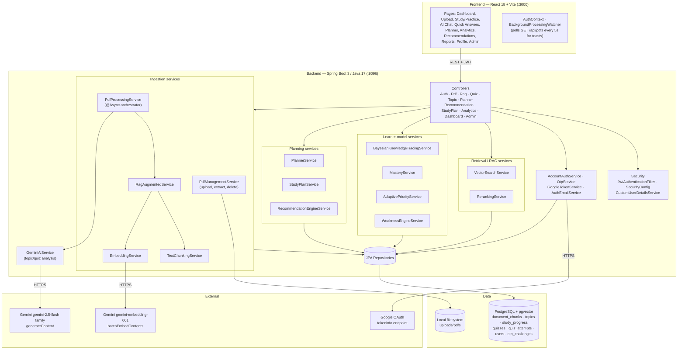
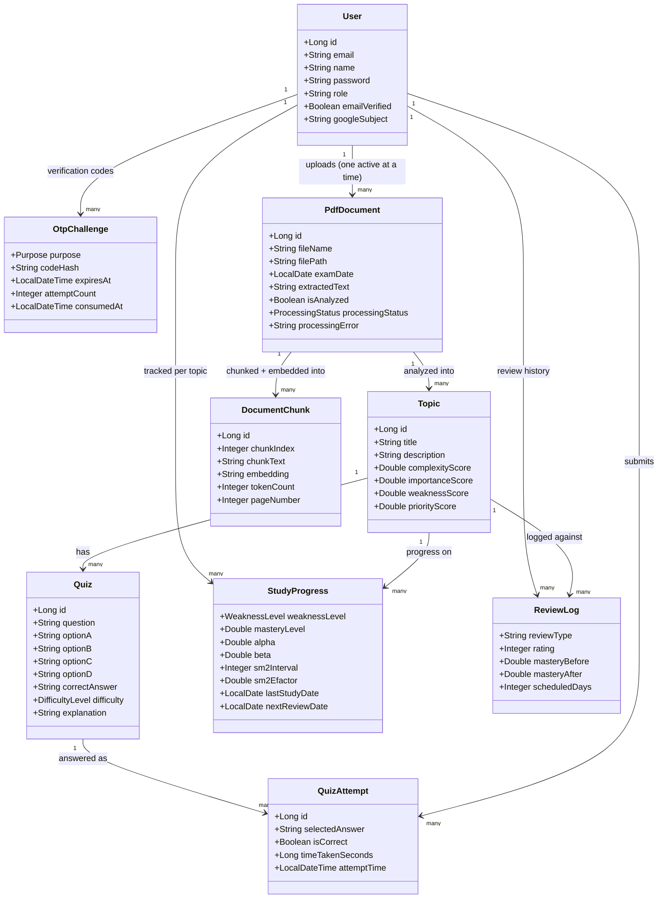
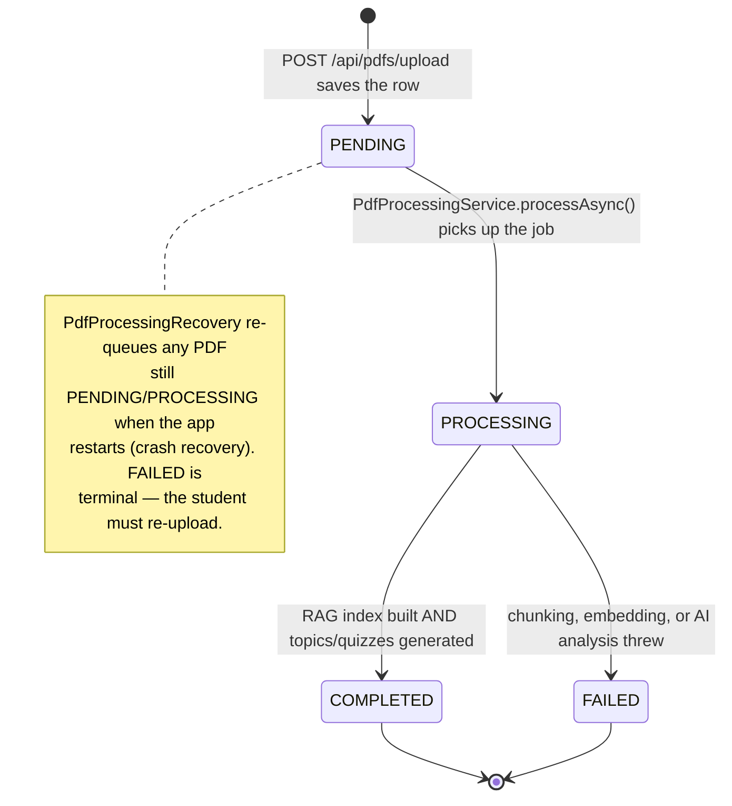
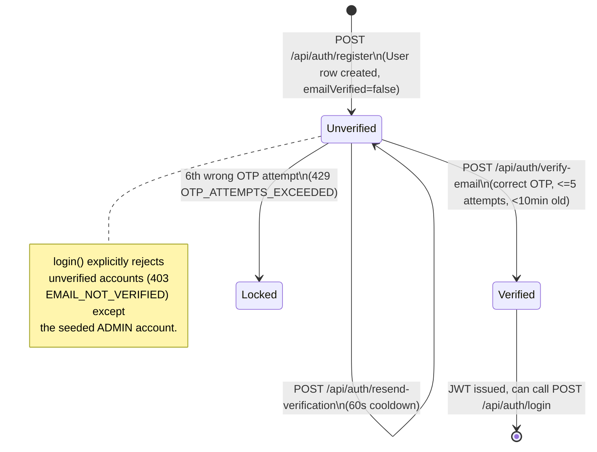
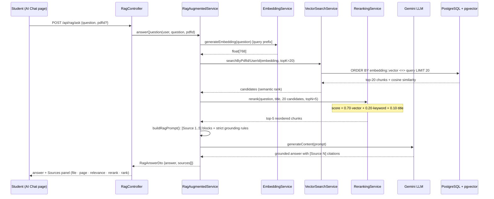
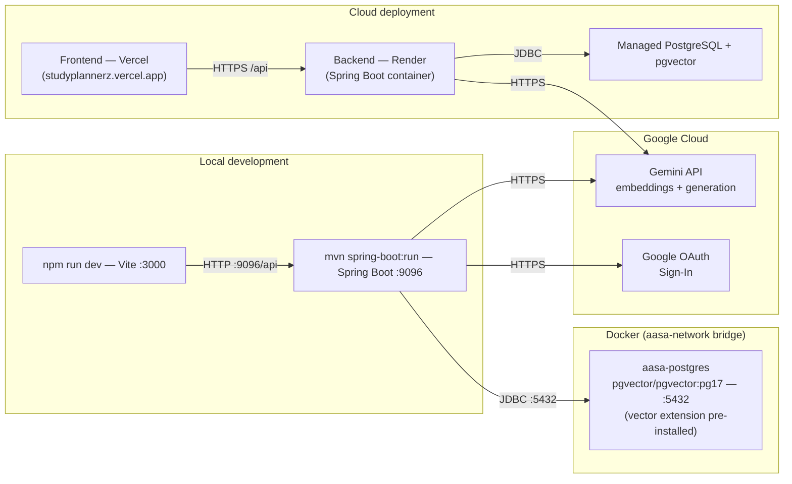

# AASA — AI Study Planner: Complete Project Documentation

This document explains **everything**: what the system does, how every algorithm works,
the complete API surface, the complete data model, authentication/security, where
AI/ML/NLP is used, what every diagram should look like, what Docker does, how to verify
each feature, and — honestly — what is still incomplete or inconsistent. It is written to
stand on its own: read top to bottom and you should not need to open the source code to
explain any part of this project in depth (for a viva, a report chapter, or a handoff).

> Diagrams use [Mermaid](https://mermaid.js.org/) — they render directly in VS Code
> (Markdown Preview Mermaid Support extension), on GitHub, and in Claude Artifacts.
> This file owns the **structural** diagrams (class, state, component, deployment) plus
> the key sequence diagrams. `WORKFLOW.md` owns extra **process** diagrams and a viva
> cheat sheet; `EVALUATION.md` owns the RAG metrics table — read this file first.

---

## 1. What the project is (elevator pitch)

AASA is an **adaptive AI study assistant**. A student uploads lecture PDFs; the system
extracts the text, splits it into semantic chunks, converts each chunk into a 768-dimension
embedding vector, and stores them in PostgreSQL with the **pgvector** extension. When the
student asks a question, the system retrieves the most semantically similar chunks,
**reranks** them with a hybrid scoring model, and makes **Gemini generate an answer strictly
grounded in those sources with page-level citations**. In parallel, every quiz answer feeds a
**Bayesian Knowledge Tracing** model that estimates the student's mastery of each topic; an
**exponential forgetting curve** estimates how likely the student is to have forgotten it;
and an **adaptive priority formula** combines mastery, forgetting risk, exam urgency, and
topic importance to decide *what to study next*.

> Core contribution: **Adaptive Knowledge-Tracing and RAG Recommendation Algorithm** —
> priorities come from actual learner performance (not manual ratings), and study content is
> generated only from the student's own verified material (not the LLM's imagination).

---

## 2. System architecture

```
                        ┌──────────────────────────────┐
   Student ──browser──▶ │  React frontend (Vite) :3000 │
                        └──────────────┬───────────────┘
                                       │ REST + JWT (axios, /api)
                        ┌──────────────▼───────────────┐
                        │ Spring Boot backend :9096    │
                        │  Auth · PDFs · Quizzes · RAG │
                        └───┬────────────────┬─────────┘
              JDBC/Hibernate│                │ HTTPS
            ┌───────────────▼──────┐   ┌─────▼──────────────────┐
            │ PostgreSQL + pgvector│   │ Google Gemini API      │
            │ users, pdf_documents,│   │  • gemini-embedding-001│
            │ document_chunks      │   │    (768-dim vectors)   │
            │  (embedding vectors),│   │  • gemini-2.5-flash    │
            │ topics, study_       │   │    family (analysis/   │
            │  progress, quiz_     │   │    QA/quiz generation) │
            │  attempts            │   └────────────────────────┘
            └──────────────────────┘
```

- **Frontend** (`frontend/src`) — React pages: Dashboard, Upload/PDF detail, Study/Practice,
  **AI Chat** (`/ai-chat`, the RAG demo), Quick Answers, Planner, Analytics, Recommendations,
  Reports, Profile, Admin.
- **Backend** (`backend/src/main/java/com/aasa`) — Spring Boot 3, Java 17. Controllers expose
  REST; services hold all logic; JPA repositories talk to Postgres.
- **Database** — PostgreSQL running inside Docker **with pgvector**, so vectors are stored
  and searched *inside* the database (no separate vector server).
- **Gemini cloud APIs** — one model produces embeddings, another produces analysis/answers/quizzes.

A fuller, diagram-first view of this same system is in **Section 3** below.

---

## 3. System & process diagrams

This section is the diagram catalogue a System Analysis and Design chapter needs: what each
diagram is, why it exists, and a ready-to-render Mermaid version of it.

### 3.1 Component diagram

Shows the major building blocks and which ones talk to which — the right diagram for
"how is the codebase organized."



### 3.2 Class diagram

The core domain model — the entities every algorithm reads or writes, and how they relate.



### 3.3 State diagram — PDF processing lifecycle



### 3.4 State diagram — email verification (auth)



### 3.5 Sequence diagram — PDF upload & background processing

The exact call order inside `PdfProcessingService.processAsync()` — chunking/embedding
runs **before** topic/quiz analysis, matching the extraction → chunking → embedding →
AI-analysis pipeline this system is designed around.

```mermaid
sequenceDiagram
    participant U as Student
    participant PC as PdfController
    participant PM as PdfManagementService
    participant PP as PdfProcessingService (async)
    participant RAG as RagAugmentedService
    participant TA as TopicAnalysisService
    participant DB as PostgreSQL + pgvector
    participant G as Gemini API

    U->>PC: POST /api/pdfs/upload (file, examDate)
    PC->>PM: uploadPdf()
    PM->>PM: extract text (PDFBox); delete this user's prior PDF/data
    PM->>DB: save PdfDocument (status = PENDING)
    PM-->>PC: PdfDocumentDto
    PC->>PP: processAsync(pdfId)  [@Async — returns immediately]
    PC-->>U: 201 Created (analysis continues in background)

    Note over PP: status = PROCESSING
    PP->>RAG: reprocessPdfForRag(pdf)
    RAG->>RAG: chunk text (TextChunkingService)
    RAG->>G: batchEmbedContents(chunks) — gemini-embedding-001
    G-->>RAG: 768-dim vectors
    RAG->>DB: atomically replace this PDF's document_chunks
    PP->>TA: analyzeAndCreateTopics(pdf)
    TA->>G: analyzeContent(extractedText) — gemini-2.5-flash family
    G-->>TA: topics + quizzes (structured JSON)
    TA->>DB: save Topic + Quiz rows
    PP->>DB: status = COMPLETED
    Note over U: BackgroundProcessingWatcher polls GET /api/pdfs every 5s,<br/>fires a toast/desktop notification when ready
```

### 3.6 Sequence diagram — RAG "ask a question" flow



### 3.7 Deployment diagram



`docker-compose.yml` (repo root) is the authority for the local/Docker topology on the left;
`cors.allowed-origins` in `application.properties` and the frontend's `.env.production` are
the authority for the cloud topology on the right.

---

## 4. What Docker does (and why)

`docker-compose.yml` starts three containers on one private bridge network (`aasa-network`):

| Container | Image / build | Port | Role |
|---|---|---|---|
| `aasa-postgres` | `pgvector/pgvector:pg17` | 5432 | Database **with the pgvector extension pre-installed**. Data survives restarts via the `postgres_data` volume. On first start it runs `docs/schema.sql` automatically. Has a healthcheck (`pg_isready`). |
| `aasa-backend` | built from `backend/Dockerfile` | 9096 | Spring Boot app. Connects to Postgres **by container name** (`jdbc:postgresql://postgres:5432/aasa_db`). Reads `GEMINI_API_KEY` from env. Uploads persisted via volume mount. |
| `aasa-frontend` | built from `frontend/Dockerfile` | 3000 | React app; `VITE_API_URL=http://localhost:9096/api`. |

**Why Docker here:** (1) the local machine's PostgreSQL did not have the `vector` extension —
the `pgvector/pgvector` image ships with it compiled in; (2) everyone gets the identical
database version/schema; (3) `depends_on: service_healthy` guarantees the backend only boots
after the DB is ready; (4) one command (`docker compose up`) starts the whole stack.

You currently run **Postgres in Docker** (container `aasa-postgres`, port 5432) and the
backend/frontend natively — `backend/.env` points at `DB_PORT` (native Postgres installs
commonly differ from the Docker default; confirm against your own `.env`), `SERVER_PORT=9096`.
That is fully supported: the backend just needs *a* reachable Postgres with pgvector.

---

## 5. End-to-end data flow

**Ingestion (once per PDF, orchestrated by `PdfProcessingService.processAsync`):**
```
upload PDF (≤50 MB) → text extracted at upload time (PDFBox) → saved as PENDING
  → processAsync() marks PROCESSING, then runs, IN ORDER:
     1. RagAugmentedService.reprocessPdfForRag(pdf)
          → TextChunkingService.chunkDocument(): semantic chunking (~512 tokens, overlap 200)
          → EmbeddingService.generateEmbeddings(): batches of 20 → 768-dim vectors
          → DocumentChunkRepository: chunks + embeddings replaced atomically
     2. TopicAnalysisService.analyzeAndCreateTopics(pdf)
          → GeminiAiService.analyzeContent(): LLM extracts topics w/ importance & complexity (JSON)
          → Topic rows created (initial adaptive priority computed)
          → QuizEngineService: quiz rows created per topic
  → status = COMPLETED (or FAILED, with the error surfaced to the UI)
```
Chunking/embedding runs **before** topic analysis so the RAG index exists as soon as
processing completes — a student can ask questions the moment the PDF turns "ready," not
only after topics finish generating.

**Question answering (every question):**
```
question → EmbeddingService.generateEmbedding()          [query prefix]
  → VectorSearchService.searchByPdfId/searchByUserId     [pgvector cosine, top 20]
  → RerankingService.rerank()                            [hybrid score, keep top 5]
  → buildRagPrompt(): [Source 1..5] blocks + strict rules
  → GeminiAiService generation call                      [grounded answer]
  → RagAnswerDto { answer, sources[] }                   [page numbers + scores]
  → AiChat.jsx renders answer + Sources panel
```

**Learning loop (every quiz attempt):**
```
answer recorded (correct?, response time) → QuizAttempt row
  → MasteryService.updateAfterAttempt(): Beta-Binomial posterior + SM-2 schedule
                                          + Bayesian Knowledge Tracing update
  → StudyProgressService.updateTopicPriorities():
        AdaptivePriorityService.calculatePriority(mastery, forgettingRisk, urgency, importance)
  → Topic.priority_score updated → Dashboard/Planner re-rank what to study next
```

See Section 3.5/3.6 for these same two flows as sequence diagrams.

---

## 6. Authentication & security

**Files:** `security/JwtTokenProvider.java`, `security/JwtAuthenticationFilter.java`,
`security/CustomUserDetailsService.java`, `config/SecurityConfig.java`,
`controller/AuthController.java`, `service/AccountAuthService.java`, `service/OtpService.java`,
`service/GoogleTokenService.java`, `service/AuthEmailService.java`.

### 6.1 `/api/auth/**` endpoints

| Method | Path | Purpose |
|---|---|---|
| POST | `/register` | Create an unverified account, send a 6-digit email OTP |
| POST | `/login` | Authenticate a **verified** account, issue a JWT |
| POST | `/verify-email` | Confirm the OTP, mark verified, **log the user in** (returns a JWT) |
| POST | `/resend-verification` | Reissue the OTP (60s cooldown) |
| POST | `/forgot-password` | Issue a password-reset OTP if the account exists (silent no-op otherwise) |
| POST | `/reset-password` | Verify the OTP, set a new password (no JWT returned — client must call `/login` again) |
| POST | `/google` | Verify a Google ID token, create/link an account, issue a JWT |

All are `permitAll()` in `SecurityConfig`.

### 6.2 JWT mechanics

- Library: `io.jsonwebtoken` (JJWT), **HS512**, symmetric key from `jwt.secret`
  (`application.properties`: `${JWT_SECRET:<hardcoded fallback>}` — the fallback is a
  literal string committed in the repo; production deployments must override it via the
  `JWT_SECRET` environment variable, or every deployment shares the same signing key).
- **Expiration:** `jwt.expiration=86400000` — a hardcoded **24 hours**, no env override.
- **Claims:** only `sub` (email), `iat`, `exp` — **no role, no userId inside the token
  itself**. Role/userId are returned separately in the login response body
  (`AuthResponse`), not embedded in the JWT.
- **Validation** (`JwtAuthenticationFilter`, registered before Spring's standard
  username/password filter): strip `Bearer `, verify signature + expiry, load the user by
  the token's subject (email), and set the `SecurityContext` if it all checks out. Any
  failure is logged and the request proceeds **unauthenticated** — Spring Security's
  `anyRequest().authenticated()` then rejects it downstream with a 401/403. Session policy
  is `STATELESS`; CSRF is disabled (appropriate for a token-based API with no cookies).

### 6.3 Password & OTP storage

- Passwords: `BCryptPasswordEncoder` (default strength), applied on register/login/reset.
- **OTP codes are hashed with the same `BCryptPasswordEncoder` bean** before being stored —
  a 6-digit code is never persisted in plaintext.
- Google-created accounts get a throwaway BCrypt hash of a random UUID as their `password`
  column value (never intended to be used to log in with a password).

### 6.4 Email verification (OTP) flow

| Parameter | Value | Source |
|---|---|---|
| Code format | 6 digits, zero-padded, `java.security.SecureRandom` | `OtpService` |
| Expiry | 10 minutes (default) | `app.auth.otp.expiration-minutes` |
| Resend cooldown | 60 seconds (default) | `app.auth.otp.resend-cooldown-seconds` |
| Max verify attempts | 5 (hardcoded) | `OtpService.MAX_ATTEMPTS` |

Issuing a new code invalidates any earlier unconsumed code for that user+purpose, so only
the newest code is ever valid. Exceeding 5 wrong attempts returns `429 OTP_ATTEMPTS_EXCEEDED`.

**Operational requirement:** `AuthEmailService` only sends real email when
`app.mail.enabled=true` (SMTP configured). With mail disabled (the default), registration
only succeeds if `app.auth.otp.log-codes=true` (the code is written to the server log
instead of emailed) — otherwise `/register` fails with `503 EMAIL_NOT_CONFIGURED`. Either
SMTP or `OTP_LOG_CODES=true` must be set for registration to work in a given environment.

### 6.5 Google Sign-In flow

`GoogleTokenService` calls Google's `tokeninfo` endpoint directly over HTTPS (no Google SDK
dependency), then validates `iss`, `email_verified`, `aud` (must equal the configured
`GOOGLE_CLIENT_ID`), and `exp` before trusting the token. A matched or newly-created user is
auto-verified (`emailVerified=true`) and issued a normal JWT — Google sign-in and
email/password sign-in produce the same kind of session token afterward.

### 6.6 Role-based access (admin)

- `SecurityConfig`: `/api/admin/**` requires `hasRole("ADMIN")`, derived from the plain
  `User.role` column (`CustomUserDetailsService` maps it to the Spring authority
  `"ROLE_" + role`). There is no separate roles table — becoming admin means the `role`
  column literally equals `"ADMIN"`.
- `AdminController` additionally re-checks the role manually in every handler
  (`checkAdmin()`), independent of Spring Security's own check.
- An admin account (`admin@aasa.com` / `admin123`) is auto-seeded on every application
  startup if it doesn't already exist (`AuthService.initAdmin`, an `ApplicationReadyEvent`
  listener) — **change this password before any real deployment.**

### 6.7 CORS

`SecurityConfig` builds the CORS policy from `cors.allowed-origins` in
`application.properties` (comma-separated, pattern-matched so `https://*.vercel.app` works).
See Section 20 for a caveat about this overlapping with per-controller `@CrossOrigin`
annotations.

---

## 7. Chunking — how a PDF becomes retrievable pieces

**File:** `service/TextChunkingService.java`

Raw extracted text is cut into overlapping windows so that each piece is small enough to
embed and retrieve precisely, but complete enough to be understandable on its own:

| Constant | Value | Meaning |
|---|---|---|
| `CHUNK_SIZE_CHARS` | 2048 | target ≈ **512 tokens** per chunk (1 token ≈ 4 chars in English) |
| `CHUNK_OVERLAP_CHARS` | 200 | consecutive chunks share 200 chars so sentences spanning a boundary are never lost |
| `MAX_CHUNKS` | 500 | hard cap per PDF (≈ 1 MB of text) |

This is *semantic* chunking because the cutter prefers natural boundaries: inside each
window it looks for the last **paragraph break** (`\n\n`); if none, the last **sentence end**
(`". "`); only as a last resort does it hard-cut. Each chunk stores metadata used later:
`chunk_index` (order), `token_count` (estimated), and `page_number`
(estimated at ~3000 chars/page — this is what powers "page 14" in citations).

*Why chunking matters:* embeddings describe one idea well when the text is paragraph-sized;
a whole lecture is too coarse to retrieve precisely, and single sentences are too thin to
generate from.

---

## 8. Embeddings — the neural text-representation model (ML part 1)

**File:** `service/EmbeddingService.java`

An **embedding** maps text to a point in a high-dimensional vector space where *semantic
similarity becomes geometric closeness*: texts about the same concept land near each other
even if they share no words ("OSI layer for physical transmission" ≈ "cables and signals").

Implementation facts you should quote:

- Model: **`gemini-embedding-001`**, endpoint `models/gemini-embedding-001:batchEmbedContents`.
- Output: **768 float dimensions** per text (`EMBEDDING_DIMENSION = 768`, requested via the
  `outputDimensionality` request field and validated on every response).
- **Asymmetric retrieval prefixes** (instruction-tuned embedding): queries are sent as
  `"task: question answering | query: <question>"`; documents as `"title: none | text: <chunk>"`.
  This matches question-style searches against document-style content — a known retrieval trick.
- Documents are embedded in **batches of 20** (one network call per 20 chunks), with up to
  3 attempts, exponential backoff, and honoring of HTTP `Retry-After`.
- Vectors are validated (dimension count, no NaN/Inf, non-zero magnitude) then stored in
  `document_chunks.embedding` as a pgvector **text literal** `[0.12,-0.34,…]`.

Cosine similarity (what retrieval uses):
```
cos(q, c) = (q · c) / (‖q‖ × ‖c‖)      ∈ [-1, 1];  1 = same direction/topic
```

---

## 9. Vector search — pgvector cosine retrieval

**File:** `service/VectorSearchService.java`

```sql
SELECT id, pdf_id, chunk_index, chunk_text, token_count, page_number, created_at,
       1 - (embedding::vector <=> CAST($2 AS vector)) AS similarity
FROM document_chunks
WHERE pdf_id = $1
ORDER BY embedding::vector <=> CAST($2 AS vector)
LIMIT $3;
```

- `<=>` is pgvector's **cosine distance** operator; `similarity = 1 − distance` converts it to
  an intuitive 0..1 relevance score (this is the number shown in the UI).
- The stored text literal is cast with `::vector` **at query time**, so existing rows never
  needed migration.
- Two scopes: per-PDF (`WHERE pdf_id = $1`) and user-wide (`JOIN pdf_documents … WHERE
  user_id = $1`) — the join makes cross-user leakage impossible: retrieval is ownership-aware.
  (Contrast this with Section 20 — not every endpoint in the system is this careful.)
- Parameters are positional (`$1…`) because Hibernate 6's native-query parser mis-handles
  named `:param` markers when the SQL also contains PostgreSQL `::` casts (a real bug we hit
  and fixed — good war story for the viva).

---

## 10. Hybrid reranking (NLP part) — deciding what Gemini actually reads

**File:** `service/RerankingService.java`

Vector similarity alone can rank a *topically similar* chunk above the chunk that *literally
answers* the question. So we retrieve generously (**top 20**) and re-score each candidate:

```
rerankScore = 0.70 × vectorSimilarity      ← semantic closeness (pgvector)
            + 0.20 × keywordOverlap        ← exact-term evidence
            + 0.10 × titleMatch            ← topical anchor bonus
```

- `tokenize()` = classical NLP preprocessing: lowercase, extract `[a-z0-9]+` tokens,
  remove ~40 English stop words (*what, is, the, explain…*).
- `keywordOverlap = |queryTokens ∩ chunkTokens| / |queryTokens|` — recall of question terms.
- `titleMatch` = 1.0 when a word from the PDF title appears in *both* question and chunk.
- Output sorted descending; top **5** go to the LLM. Each result keeps its original
  `retrievalRank`, so you can *show the order changed* — demonstrable reranking.

*Why not just top-5 by vector?* Keyword evidence rescues exact names/formulas embeddings may
blur; the weights favor the strong learned signal while leaving room for lexical evidence.
Upgrade path: replace with a cross-encoder reranker — interface stays identical.

---

## 11. Grounded generation & citations

**Files:** `service/RagAugmentedService.java`, `service/GeminiAiService.java`,
`controller/RagController.java`, `frontend/src/pages/AiChat.jsx`

- Endpoint **`POST /api/rag/ask`** `{ question, pdfId? }` → `RagAnswerDto { answer, sources[] }`.
- Prompt rules enforced in `buildRagPrompt()`: use ONLY the `[Source N]` blocks; invent
  nothing; if evidence is insufficient say exactly that; cite every factual statement inline
  as `[Source N]`; never append a Sources section (the UI renders it from structured data).
- Generation model chain with automatic fallback: `gemini-3.5-flash (v1beta) → gemini-2.5-flash
  (v1)`; temperature **0.3**; retries on 429/503 with backoff. (`GeminiAiService`'s own
  topic/quiz-analysis chain is separate and wider: `gemini-2.5-flash → 2.0-flash →
  2.5-flash-lite → 3.1-flash-lite`.)
- Every source returned to the UI carries: file name, page number, `similarity` (vector),
  `rerankScore`, final `rank`. The AI Chat page lists them under the answer:
  `Lecture_notes.pdf — page 14 — relevance 0.91 · rerank 0.87 · rank #1`.

This is what makes answers **verifiable and hallucination-resistant**: the LLM is a
*reader* of your material, not an oracle.

> **Implementation integrity check.** Two failure points were audited and corrected during
> review: (1) the embedding model string had drifted to a name Google's API does not serve
> (`gemini-embedding-2`) — fixed to `gemini-embedding-001`; (2) the chunk/embed step existed
> as working code but was never invoked from the upload path — `PdfProcessingService` now
> calls `RagAugmentedService.reprocessPdfForRag()` before topic analysis (Section 3.5). Both
> are covered by the automated test suite (Section 18.3).

---

## 12. THE main algorithm — Adaptive Knowledge-Tracing and RAG Recommendation

This replaced the old fixed weighted score
(`0.35·complexity + 0.25·importance + 0.25·manualWeakness + 0.15·urgency`, originally in
`ScoringEngineService.calculatePriorityScore`, now `@Deprecated` and not called from the
mastery/planner path). The new pipeline is:

```
answer history → BKT mastery → forgetting risk → adaptive priority → RAG content selection
```

> **The migration is not 100% complete** — see Section 20.1. `PlannerService` and
> `TopicController` use the new formula below; `RecommendationEngineService` (which powers
> the Recommendations page) independently still runs the old 0.35/0.25/0.25/0.15 formula.
> State this precisely in a report rather than claiming a universal replacement.

### 12.1 Bayesian Knowledge Tracing (mastery from performance)

**File:** `service/BayesianKnowledgeTracingService.java`

BKT maintains P(K): the probability the student has *mastered* the skill behind a topic.
Each answer updates it by Bayes' rule, correcting for lucky guesses and unlucky slips:

```
correct   P(obs) = (1−s)·P / [ (1−s)·P + g·(1−P) ]
incorrect P(obs) = s·P     / [ s·P     + (1−g)·(1−P) ]
learning  P(new) = P(obs) + (1−P(obs))·ℓ
```

Parameters: guess `g = 0.20` (unprepared student still right), slip `s = 0.10`
(prepared student still wrong), learn `ℓ = 0.40` after correct practice, `0.15` after
reviewing a mistake's feedback.

**Worked example** (quote this in the viva): mastery P = 0.40, student answers correctly:
- numerator `(1−0.10)·0.40 = 0.36`; denominator `0.36 + 0.20·0.60 = 0.48`
- posterior `0.36/0.48 = 0.75` → after learning step `0.75 + 0.25·0.40 = 0.85`

One correct answer moved belief from 40% → 85% — because guessing can't explain it well.
An incorrect answer at P = 0.85 drops to ≈ 0.55 (a slip is plausible but so is over-rating).

### 12.2 Forgetting risk (memory decay)

Same file. Exponential forgetting curve fitted to mastery strength:

```
forgettingRisk = 1 − e^(−λ · daysSinceLastReview),   λ = 0.15 × (1.6 − mastery)
```

λ grows as mastery falls, so fragile knowledge decays faster (spacing-effect aware).
Example: mastery 0.5 after 7 days → λ = 0.165, risk = 1 − e^(-1.155) ≈ **0.68**.
Reviewed today → risk exactly 0.

### 12.3 Adaptive priority (the decision formula)

**File:** `service/AdaptivePriorityService.java`

```
priority = 0.40 × (1 − masteryProbability)      ← knowledge gap (BKT)
         + 0.25 × forgettingRisk                ← memory decay (curve above)
         + 0.20 × examUrgency = 1/(days+1)      ← deadline pressure
         + 0.15 × topicImportance               ← AI-assessed weight (Gemini analysis)
```

Where each input comes from — **all evidence-based, none manual**:

| Input | Source |
|---|---|
| `masteryProbability` | BKT update on every quiz attempt (`MasteryService.updateAfterAttempt`) |
| `daysSinceLastReview` | `StudyProgress.lastStudyDate` (set when the student studies/is quizzed) |
| `examDate` | `PdfDocument.examDate`; urgency = 1/(daysUntilExam+1): 1.0 on exam day, halves daily |
| `topicImportance` | Gemini structured topic analysis at ingestion (fallback 0.5) |

Worked example: mastery 0.3, last studied 6 days ago (risk ≈ 0.62), exam in 9 days
(urgency 0.1), importance 0.8 →
`0.40·0.70 + 0.25·0.62 + 0.20·0.10 + 0.15·0.8 = 0.28+0.155+0.02+0.12 = 0.575`.
Study that tonight; another topic at mastery 0.9, reviewed today, no exam scores ≈ 0.07.

Call sites: `StudyProgressService.updateTopicPriorities` (after every attempt),
`PlannerService.buildWeakTopicAnalysis` (every planner load), `TopicController.updateWeakness`
(manual weakness edits), `TopicAnalysisService.createTopicFromAnalysis` (initial priors for
brand-new topics). **Not** called by `RecommendationEngineService` — see Section 20.1.

### 12.4 Supporting algorithms kept underneath

**File:** `service/MasteryService.java` (runs inside the same `updateAfterAttempt` call as BKT)

- **Beta-Binomial mastery** — a second, independent posterior estimate. Each topic tracks
  `alpha`/`beta` (success/failure counts, Laplace prior α₀=2, β₀=8); a correct answer
  increments alpha, an incorrect one increments beta (plus a small beta penalty for
  suspiciously fast correct guesses); mastery estimate = `alpha / (alpha + beta)`.
- **Blended mastery** — the mastery actually stored is
  `0.5 × betaBinomialMastery + 0.5 × bktMastery`: two independent probabilistic estimators
  (a long-run frequency view and a guess/slip-aware Bayesian view) averaged so neither
  estimator's blind spot dominates.
- **SM-2 spaced repetition** — classic Anki/SuperMemo algorithm: response quality (0–4,
  derived from correctness + response time) drives repetition count, an ease factor (≥1.3),
  and the next interval (1 day → 6 days → `previous interval × ease factor`, resetting to 1
  on a wrong/slow answer). Produces `nextReviewDate`, independent of but stored alongside
  the priority-driving mastery figures.
- **Evidence-based weakness** (`WeaknessEngineService.calculateEvidenceBasedWeakness`) —
  requires ≥3 attempts or returns `INSUFFICIENT_DATA`; otherwise:
  ```
  weightedErrorRate  = incorrect-weighted attempts / total-weighted attempts
                       (per-attempt weight: EASY=1.0, MEDIUM=1.5, HARD=2.0)
  masteryGap         = 1 − masteryLevel
  slowResponseFactor = mean(min(responseSeconds/60, 1.0)) across attempts
  overdueFactor      = 1.0 if nextReviewDate is in the past, else 0.0

  score = 0.60·weightedErrorRate + 0.25·masteryGap
        + 0.10·slowResponseFactor + 0.05·overdueFactor        (clamped to [0,1])
  ```
  `score ≥ 0.65` → HIGH, `≥ 0.35` → MEDIUM, else LOW. A separate simpler method,
  `getWeaknessScore(level)`, maps a label back to a scalar for formulas that need one
  (LOW→0.2, MEDIUM→0.5, HIGH→0.9, INSUFFICIENT_DATA→0.6, NOT_ATTEMPTED→1.0).

---

## 13. Where AI / ML / NLP is used — the one-slide answer

| # | Capability | Technique (say this) | Code |
|---|---|---|---|
| 1 | Topic extraction from PDFs | **LLM** structured-output JSON (≤20 topics, importance, complexity), temp 0.2, model fallback chain | `GeminiAiService.analyzeContent`, `TopicAnalysisService` |
| 2 | Text representation | **Neural embeddings**, gemini-embedding-001, 768-dim, asymmetric query/doc prefixes, batching + retries | `EmbeddingService` |
| 3 | Finding relevant content | **Vector similarity search**, pgvector cosine `<=>`, ownership-scoped SQL | `VectorSearchService` |
| 4 | Ordering what the LLM reads | **Hybrid reranking**: 0.70 vector + 0.20 keyword + 0.10 title; top-20 → top-5 | `RerankingService` |
| 5 | Tokenization/stop-words for scoring | **Classical NLP** preprocessing (`[a-z0-9]+`, stop-word sets, set overlap) | `RerankingService.tokenize` |
| 6 | Grounded answering with citations | **RAG prompt engineering** — only-source context, forced `[Source N]` cites, refuse-if-insufficient | `RagAugmentedService.buildRagPrompt` |
| 7 | Quiz generation | **LLM generation over reranked RAG context** (8 chunks) as JSON | `generateQuizContext` → `QuizEngineService` |
| 8 | Mastery estimation | **Bayesian Knowledge Tracing** (probabilistic user model: guess/slip/learn) | `BayesianKnowledgeTracingService` |
| 9 | Memory decay | **Exponential forgetting curve**, mastery-scaled λ | same file |
| 10 | What-to-study-next decision | **Adaptive weighted priority** from learner evidence | `AdaptivePriorityService` |
| 11 | Review scheduling | **SM-2 spaced repetition** + Beta-Binomial posterior | `MasteryService` |
| 12 | Weakness measurement | Weighted evidence stats (error rate, response time, overdue) | `WeaknessEngineService` |
| 13 | Study-plan ranking | Recommendation scoring (legacy formula — Section 20.1) | `RecommendationEngineService` |
| 14 | Identity verification | Google ID-token validation (issuer/audience/expiry checks) | `GoogleTokenService` |

**ML vs AI vs NLP in one sentence:** the embedding model is *machine learning*; BKT and the
forgetting curve are *probabilistic ML models of the learner*; Gemini analysis/QA/quiz are
*LLM usage*; tokenization + keyword overlap are *NLP*; retrieval + reranking + grounded
generation together form the *RAG pipeline*.

---

## 14. Quiz, planner & recommendation flows

**Quiz generation:** topic chosen → `generateQuizContext(pdfId, title)` embeds the title →
vector search top-20 → rerank to 8 chunks → Gemini generates questions (with correct answers
and explanations) strictly from that context → student answers recorded in `quiz_attempts`
(correct flag + response time) → BKT/mastery/priority update (Section 12).

**`PlannerService` (`GET /api/planner`)** — recomputed from live DB state on every call, no
persistence, no LLM call:
- `estimateDuration = 30 + int(complexity×60) + int(weakness×45)` minutes (appends "split
  into 2 sessions" past 90 minutes).
- `weakTopics` = `masteryLevel < 70 OR weaknessScore > 0.5`.
- `todayTasks` (max 5): low-mastery+high-weakness topics get LEARN blocks first, then
  medium-mastery topics get REVISION, then high-importance-but-not-mastered topics get
  PRACTICE, then near-mastered topics get a light REVISION.
- `studyRoadmap` spans `min(daysUntilExam, 14)` days (floored to 7 if the exam already
  passed or is unset), alternating LEARN/PRACTICE/REVISION blocks by weakness/importance.
- `revisionSchedule` frequency is threshold-based on weakness/mastery ("Every day" /
  "Every 2 days" / "Every 3 days" / "Every 7 days") — not a real spaced-repetition date
  lookup, just a descriptive label.

**`StudyPlanService` (`POST /api/study-plan/generate`)** — a separate, **stateless**
generator: takes a request body (topics + metrics + time budget) and computes a plan with
`computePriority = (weakness × importance × difficulty) / (mastery + 0.1)`, capping the
schedule to the top 8 topics by that score and packing fixed-time blocks (learning
09:00–10:30, revision 14:00–14:30) across the given day count. Nothing is persisted; calling
it again with the same input reproduces the same plan.

**`RecommendationEngineService` (`GET /api/recommendations/**`)** — ranks topics with
`score = 0.35·complexity + 0.25·importance + 0.25·weakness + 0.15·urgency` (the pre-BKT
formula — see Section 20.1), and separately computes `getStudyInsights` (accuracy, total
time, top-5 strengths/weaknesses by best score) and `getStudySchedule` (topics spread evenly
across N days).

---

## 15. Complete data model (entity dictionary)

Source of truth is the JPA `@Entity` classes (`backend/src/main/java/com/aasa/entity/`);
`docs/schema.sql` is the bootstrap DDL for a fresh database and is **not** kept in sync by
hand — see Section 20.2.

| Entity (table) | Key fields | Relationships |
|---|---|---|
| **User** (`users`) | `email` (unique), `name`, `password` (BCrypt), `role` (default `USER`), `emailVerified`, `googleSubject` (unique, nullable), `createdAt`/`updatedAt` | 1→many `PdfDocument`, `QuizAttempt`, `StudyProgress`, `OtpChallenge`, `ReviewLog` |
| **OtpChallenge** (`otp_challenges`) | `purpose` (`EMAIL_VERIFICATION`\|`LOGIN`\*\|`PASSWORD_RESET`), `codeHash` (BCrypt), `expiresAt`, `attemptCount`, `consumedAt` | many→1 `User` (\*`LOGIN` purpose is declared but never issued in the current code) |
| **PdfDocument** (`pdf_documents`) | `fileName`, `filePath`, `uploadDate`, `examDate`, `extractedText` (TEXT), `isAnalyzed`, `processingStatus` (`PENDING`\|`PROCESSING`\|`COMPLETED`\|`FAILED`), `processingError` | many→1 `User`; 1→many `Topic`, `DocumentChunk` |
| **Topic** (`topics`) | `title`, `description`, `conceptDensity`, `keywordDifficulty`, `formulaCount`, `contentLength`, `complexityScore`, `importanceScore`, `weaknessScore`, `priorityScore` | many→1 `PdfDocument`; 1→many `Quiz`, `StudyProgress`, `ReviewLog` |
| **DocumentChunk** (`document_chunks`) | `chunkIndex`, `chunkText` (TEXT), `embedding` (TEXT — pgvector literal, cast at query time), `tokenCount`, `pageNumber` | many→1 `PdfDocument`; unique on `(pdf_id, chunk_index)` |
| **Quiz** (`quizzes`) | `question` (TEXT), `optionA..D`, `correctAnswer`, `difficulty` (`EASY`\|`MEDIUM`\|`HARD`), `explanation` (TEXT) | many→1 `Topic`; 1→many `QuizAttempt` |
| **QuizAttempt** (`quiz_attempts`) | `selectedAnswer`, `isCorrect`, `marksObtained`, `attemptTime` (auto-set), `timeTakenSeconds` | many→1 `User`, `Quiz` |
| **StudyProgress** (`study_progress`) | `weaknessLevel` (`LOW`\|`MEDIUM`\|`HIGH`\|`INSUFFICIENT_DATA`\|`NOT_ATTEMPTED`), `completionPercentage`, `bestScore`, `totalAttempts`, `correctAttempts`, `masteryLevel`, `alpha` (default 2.0), `beta` (default 8.0), `sm2Interval`, `sm2Efactor` (default 2.5), `sm2Repetitions`, `lastStudyDate`, `nextReviewDate` | many→1 `User`, `Topic`; unique on `(user_id, topic_id)` |
| **ReviewLog** (`review_log`) | `reviewType`, `rating`, `responseTimeMs`, `scheduledDays`, `actualInterval`, `masteryBefore`, `masteryAfter`, `createdAt` (**not** auto-populated — no `@PrePersist` on this entity) | many→1 `User`, `Topic` |

See Section 3.2 for the same model as a class diagram.

---

## 16. Complete API reference

Grouped by controller. "Auth" column: **Public** = `permitAll()`; **JWT** = a valid bearer
token is required but the handler does not verify the caller owns the specific record
requested; **JWT+Owner** = the handler explicitly scopes the query to the caller's own data
or 404s otherwise; **Admin** = requires `role=ADMIN` (Section 6.6).

**AuthController** (`/api/auth`, all Public) — see Section 6.1 for the full table.

**PdfController** (`/api/pdfs`)
| Method | Path | Purpose | Auth |
|---|---|---|---|
| POST | `/upload` | Upload a PDF, kick off async processing (Section 3.5) | JWT+Owner |
| GET | `` | List the caller's PDFs | JWT+Owner |
| GET | `/{pdfId}` | Fetch one PDF's summary | JWT+Owner |
| GET | `/{pdfId}/detail` | Fetch topic-level detail for one PDF | JWT+Owner |
| DELETE | `/{pdfId}` | Delete a PDF and all dependent data | JWT+Owner |
| DELETE | `/reset` | Delete **all** of the caller's data | JWT+Owner |

**RagController** (`/api/rag`)
| Method | Path | Purpose | Auth |
|---|---|---|---|
| GET | `/predefined` | Quick Answers (topic-derived, no LLM call at request time) | JWT+Owner |
| POST | `/ask` | Full RAG pipeline (Section 3.6) | JWT+Owner |

**TopicController** (`/api/topics`)
| Method | Path | Purpose | Auth |
|---|---|---|---|
| POST | `/analyze/{pdfId}` | Trigger Gemini topic analysis for a PDF | JWT |
| GET | `/pdf/{pdfId}` | List topics for a PDF | JWT |
| GET | `/ranked/pdf/{pdfId}` | Same as above — **the name is misleading, no extra ranking is applied** (Section 20.3) | JWT |
| GET | `/ranked` | Caller's topics ranked by priority | JWT+Owner |
| GET | `/{topicId}` | Fetch one topic | JWT |
| POST | `/{topicId}/update-weakness` | Manually set weakness, recompute priority | JWT |

**QuizController** (`/api/quizzes`)
| Method | Path | Purpose | Auth |
|---|---|---|---|
| GET | `/topic/{topicId}` | List quizzes for a topic | JWT |
| GET | `/progress?pdfId=` | Caller's attempted quiz IDs (404 if `pdfId` isn't owned) | JWT+Owner |
| GET | `/{quizId}` | Fetch one quiz | JWT |
| POST | `/{quizId}/submit` | Grade + store an attempt, update mastery/priority | JWT+Owner |

**PlannerController** (`/api/planner`) · **StudyPlanController** (`/api/study-plan`) ·
**RecommendationController** (`/api/recommendations`) · **AnalyticsController**
(`/api/analytics`) · **DashboardController** (`/api/dashboard`) — see Section 14 for what
each computes; all are **JWT+Owner** except `POST /api/study-plan/generate`, which takes no
`Authentication` parameter at all (**JWT** only — stateless, not scoped to a specific user).

**AdminController** (`/api/admin`, all **Admin**)
| Method | Path | Purpose |
|---|---|---|
| GET | `/dashboard` | Row counts across 6 entities |
| GET | `/entities` | Entity metadata (name, table, row count, fields) |
| GET | `/entities/{entityName}` | Paginated raw row dump (reflection-based) |
| DELETE | `/entities/{entityName}/{id}` | Cascading delete of one record (self-delete blocked) |

---

## 17. Frontend module map

**Pages** (`frontend/src/pages/`):

| Page | Route | What it does |
|---|---|---|
| Dashboard | `/dashboard` | Stat tiles, ranked topics, weak topics, PDF grid; admins see an inline entity-count view instead |
| UploadPdf | `/upload` | Upload form; shows background-processing progress, hands off to the notification watcher |
| PdfDetail | `/pdf/:pdfId` | Per-PDF stats and topic list with weakness badges |
| Learn | `/study`, `/study/:pdfId` | Topic browser linking to Quick Answers or Practice |
| Study | `/practice`, `/practice/:pdfId`, `/diagnostic/:pdfId` | The quiz-taking flow (Section 3 of this doc's earlier revision covered its UI bugs — since fixed) |
| AiChat | `/ai-chat` | The RAG demo — question box, grounded answer, Sources panel |
| QuickAnswers | `/quick-answers` | Pre-generated topic Q&A, no additional LLM call per view |
| Planner | `/planner` | Today's tasks, roadmap, revision schedule, recommendations (Section 14) |
| Recommendations | *(redirects to `/planner`)* | Ranked topics, insights, suggested schedule |
| Analytics | `/analytics` | Recharts bar/line charts of quiz performance |
| Reports | `/reports` | Study report with client-side JSON/CSV export (no backend export endpoint) |
| Profile | `/profile` | Read-only name/email; **exam date here is `localStorage`-only and separate from a PDF's real `examDate`** (Section 20.4) |
| Admin | `/admin` | Entity browser/deleter for `role=ADMIN` users |
| Login / Register / ForgotPassword / ResetPassword / VerifyEmail | various | Auth screens mapping 1:1 to Section 6.1's endpoints |

**Key components:** `Sidebar`/`Navigation` (app chrome, active-route highlighting),
`ProtectedRoute` (redirects to `/login` if no token is present — presence only, no
expiry/role check), `StudyTimer` (reusable stopwatch), `GoogleSignInButton` (wraps Google
Identity Services), `DiagnosticReminder` (global banner nudging incomplete diagnostics).

**AuthContext** — holds `user`/`token`/`loading` in React state, hydrated once from
`localStorage` on mount with no server-side validation call; `api.js`'s axios interceptors
(not `AuthContext` itself) attach the bearer token to every request and force-logout on a
401. There is no token-refresh logic anywhere in the frontend.

**Tech stack:** React 18 + Vite 5, react-router-dom 6, axios, framer-motion (animation),
recharts (charts, `Analytics.jsx` only), lucide-react (icons), react-hot-toast, Tailwind CSS.
No global state/query library — each page owns its own fetch/loading/error state.

---

## 18. How to verify everything works — the detailed checklist

### 18.1 Start the stack (exact commands)

```bat
:: 1. Database (pgvector) — must be running before the backend starts
docker compose up -d postgres
docker ps                      :: expect: aasa-postgres … Up (healthy), 0.0.0.0:5432->5432

:: 2. Backend (native, reads backend/.env)
cd backend && mvn spring-boot:run
:: wait for "Started AasaApplication" ; listens on SERVER_PORT=9096

:: 3. Frontend
cd frontend && npm run dev     :: http://localhost:3000
```

### 18.2 Infrastructure health checks

| Check | Command | Expected |
|---|---|---|
| pgvector installed | `docker exec aasa-postgres psql -U aasa_user -d aasa_db -c "SELECT extname FROM pg_extension WHERE extname='vector';"` | 1 row: `vector` |
| Tables exist | same pattern, `SELECT table_name FROM information_schema.tables WHERE table_schema='public';` | users, pdf_documents, document_chunks, topics, study_progress, quiz_attempts, quizzes, review_log, otp_challenges |
| Embeddings stored | `SELECT count(*), min(length(embedding)) FROM document_chunks;` | count > 0, length ≈ 768 floats |
| Backend up | open `http://localhost:9096/api/pdfs` (no token) | 401/403 — security active |

### 18.3 Automated tests (proof of correctness)

```bat
cd backend
mvn test                                    :: 34 unit tests (BKT, priority, reranker, services)
set RAG_INTEGRATION_TEST=true&& mvn test -Dtest=RagRetrievalIntegrationTest
                                            :: 3 tests against the LIVE Docker DB:
                                            ::  • ownership isolation
                                            ::  • different questions → different retrieved pages
                                            ::  • reranking changes retrieval order
```
All green = retrieval, reranking, BKT, and adaptive priority are mathematically verified.

### 18.4 Feature-by-feature walkthrough (do these in order)

| # | Action | Where | What proves it works |
|---|---|---|---|
| 1 | Register + verify + login | `/register` → `/verify-email` → `/login` | JWT stored; redirected to Dashboard |
| 2 | Upload a lecture PDF | `/upload` | Progress shown; on the PDF page: **topics with importance/complexity** appear (LLM analysis) and **chunks were created** |
| 3 | Verify ingestion in DB | health-check 18.2 row 3 | `document_chunks` has rows for your pdf_id |
| 4 | Ask a question | **AI Chat** (`/ai-chat`) | Answer text contains `[Source N]` markers; below it a **Sources** panel lists *file — page — relevance — rerank — rank* |
| 5 | Ask a *different* question about the same PDF | AI Chat | Different pages/sources returned → retrieval is real, not sequential chunks |
| 6 | Compare relevance vs rank | Sources panel | Order ≠ pure similarity order sometimes → **reranking changed the order** |
| 7 | Generate a quiz for a topic | Topic → Quiz | Questions reference only content from your PDF (context = reranked top-8 chunks) |
| 8 | Answer the quiz (some wrong) | Quiz page | Attempts stored; explanations come from the source chunks; correct option highlights green after submitting |
| 9 | Watch priorities adapt | Dashboard/Topics before vs after | The topic you failed re-orders upward — its mastery dropped ⇒ `(1 − mastery)` term rose (BKT at work) |
| 10 | Wait / backdate a review, refresh planner | Planner | Priority rises again over time — **forgetting curve** term grows with days since last study |
| 11 | Set an exam date near-term | PDF settings | That PDF's topics jump in priority — exam urgency `1/(days+1)` dominates |

If all 11 pass, every subsystem (ingestion, RAG, BKT, adaptive scheduling) is demonstrably live.

---

## 19. The 5-minute demo script (for the evaluator)

1. *"I upload a PDF"* → show topics auto-extracted with importance scores.
2. *"The system chunks and embeds it into pgvector before analysis even finishes"* → run the
   DB count query, or just note the AI Chat page already works while topics are still
   generating.
3. *"I ask anything — answers come only from my material"* → AI Chat: question with
   `[Source N]` citations and the sources panel with page numbers.
4. *"Retrieval is two-stage: cosine search top-20, hybrid rerank to top-5"* → point at
   relevance vs rerank/rank numbers in the panel.
5. *"I take a quiz; a Bayesian Knowledge Tracing model updates my mastery"*
   → answer some questions.
6. *"Priority = 0.40·(1−mastery) + 0.25·forgettingRisk + 0.20·examUrgency + 0.15·importance"*
   → show the topic re-ranked after the quiz; mention the forgetting-curve term.
7. Close with: *"34 unit tests plus a live-database integration test verify each stage."*

---

## 20. Known limitations & inconsistencies (read before finalizing a report)

Found during a full-codebase audit. Nothing here is fatal, but a report that claims any of
these are otherwise would be contradicted by the running code — better to state them as
scoped limitations / future work than to have an examiner find them first.

### 20.1 The adaptive-priority migration is incomplete

`AdaptivePriorityService` (Section 12.3) is the documented, tested replacement for the old
static formula — but `RecommendationEngineService` (powers `/api/recommendations/**` and the
Recommendations panel on the Planner page) still runs the **original**
`0.35·complexity + 0.25·importance + 0.25·weakness + 0.15·urgency` formula independently; it
does not call `AdaptivePriorityService` at all. `PlannerService` and `TopicController` *do*
use the new BKT-based formula. Net effect: which formula drives "what to study next" depends
on which screen/endpoint you're looking at. `RecommendationEngineService.urgencyScore` also
has no null guard on `daysUntilExam`, so a topic with no exam date set would throw an NPE if
that code path is reached with a null value. A dead `ScoringEngineService` dependency is
also autowired into `RecommendationEngineService` but never called.

### 20.2 `docs/schema.sql` has drifted from the live schema

`spring.jpa.hibernate.ddl-auto=update` lets Hibernate silently add columns the DDL file was
never updated to match — confirmed: `pdf_documents.processing_status` and
`.processing_error` (used throughout the async-processing pipeline, Section 3.3) exist on
the live entity/table but are **not** in `docs/schema.sql`. Treat the JPA `@Entity` classes
(Section 15) as the source of truth, not the SQL file, until it's regenerated from a real
`pg_dump`.

### 20.3 A few endpoints don't check resource ownership

Most of the codebase is careful about this (Section 9's ownership-scoped SQL is the model to
follow), but several endpoints accept any authenticated user's JWT without verifying the
caller owns the specific `pdfId`/`topicId`/`quizId` being requested: `POST
/api/topics/analyze/{pdfId}`, `GET /api/topics/pdf/{pdfId}`, `GET
/api/topics/ranked/pdf/{pdfId}` (which is also misleadingly named — it applies no additional
ranking beyond `GET /api/topics/pdf/{pdfId}`), `GET /api/topics/{topicId}`, `POST
/api/topics/{topicId}/update-weakness`, `GET /api/quizzes/topic/{topicId}`, and `GET
/api/quizzes/{quizId}`. A logged-in user who knows or guesses another user's numeric ID could
read (and in the weakness-update case, modify) that data. Worth closing before treating this
as production-ready, and worth being explicit about in a report's "Security considerations"
section rather than implying every endpoint is ownership-checked.

### 20.4 CORS is wider than the property file suggests

`cors.allowed-methods`, `cors.allowed-headers`, and `cors.allow-credentials` in
`application.properties` are never actually read by any Java code — `SecurityConfig`
hardcodes equivalent values directly instead, so those three properties are dead
configuration (misleading to anyone editing the properties file expecting it to take
effect). Separately, most controllers (`AdminController`, `PdfController`, `RagController`,
`TopicController`, `QuizController`, `PlannerController`, `RecommendationController`,
`StudyPlanController`, `DashboardController`, `AnalyticsController`) carry their own
class-level `@CrossOrigin(origins = "*")`, which permits **any** origin for those specific
endpoints regardless of the `cors.allowed-origins` allowlist that governs everything else.
Only `AuthController` relies solely on the global, restricted CORS policy.

### 20.5 A profile setting that looks connected to the algorithm isn't

The exam date field on the Profile page is stored only in the browser's `localStorage` and
is never sent to the backend — the value that actually drives exam urgency
(`AdaptivePriorityService`, Section 12.3) is each `PdfDocument.examDate`, set once at upload
time. A student could reasonably assume changing their profile's exam date affects their
study plan; it does not. Worth a one-line UI clarification or a real wiring fix.

### 20.6 Smaller items

- `AuthService.register`/`.login`/`.seedAdmin` are dead code — `AccountAuthService` is what
  `AuthController` actually calls; `AuthService.getUserByEmail` and its `initAdmin` startup
  listener are the only parts of that class still in active use.
- `OtpChallenge.Purpose.LOGIN` is declared but never issued or verified anywhere.
- `AdminController.deleteRecord` has an inconsistent error path: the admin-check failure is
  handled with a dedicated `403` branch in every other handler in that controller, but falls
  through to a generic `500` in this one.
- `DashboardService.generateDashboard`'s `totalQuizzes` count loops every `Quiz` row in the
  database checking containment against the user's topics, rather than a direct scoped count
  query — correct, but O(quizzes × pdfs) instead of O(1) at the database.
- The JWT itself carries no role or user-id claim (only `sub`/`iat`/`exp`); the frontend
  never checks token expiry client-side (`ProtectedRoute` only checks that a token string is
  *present*), relying entirely on the backend rejecting expired tokens and the axios
  interceptor's 401 handler to force a logout.
- Two npm dependencies (`@supabase/supabase-js`, and — outside this audit's page set —
  confirm before citing either as "in use" for a specific feature) appear to have limited or
  no active call sites; verify before describing either as load-bearing in a report.

None of the above blocks the core demo in Section 19 — they're the honest fine print.

---

## 21. Troubleshooting

| Symptom | Cause | Fix |
|---|---|---|
| Backend log: "Vector search failed … operator does not exist" or "type vector does not exist" | pgvector extension not created on this DB | `docker exec aasa-postgres psql -U aasa_user -d aasa_db -c "CREATE EXTENSION IF NOT EXISTS vector;"` |
| Searches return empty but no error | PDF still PROCESSING, or wrong pdfId | Wait for status COMPLETED; check `SELECT count(*) FROM document_chunks WHERE pdf_id=<id>;` |
| Embedding calls fail with HTTP 404 / model-not-found | Embedding model string doesn't match a model Gemini actually serves | Confirm `EmbeddingService.EMBEDDING_MODEL` is `gemini-embedding-001` |
| `/register` returns `503 EMAIL_NOT_CONFIGURED` | No SMTP configured and `OTP_LOG_CODES` not set | Set `SMTP_ENABLED=true` with real SMTP creds, or set `OTP_LOG_CODES=true` for local dev (logs the code instead of emailing it) |
| Frontend gets network errors | Port mismatch frontend↔backend | `VITE_API_URL` must match `SERVER_PORT` (both default 9096); restart `npm run dev` after changes |
| 401 on every call | JWT expired (24h) | Log out/in |
| Gemini 429/503 during upload | API quota/rate limit | Retry; EmbeddingService already retries with backoff and falls back across models |
| Integration test silently skipped | `RAG_INTEGRATION_TEST` not set to `true` (by design, so CI passes without a DB) | `set RAG_INTEGRATION_TEST=true&& mvn test -Dtest=RagRetrievalIntegrationTest` |

---

*Pair this file with `ARCHITECTURE.md` (concise system view), `WORKFLOW.md` (per-workflow
process diagrams + viva cheat sheet), and `EVALUATION.md` (RAG retrieval metrics table).*
