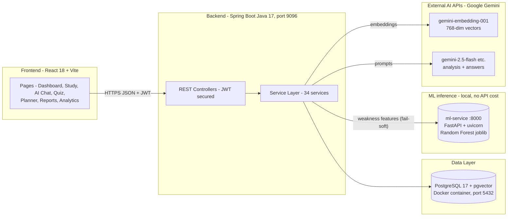
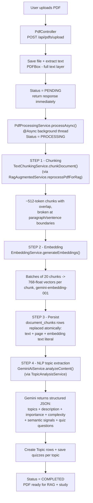
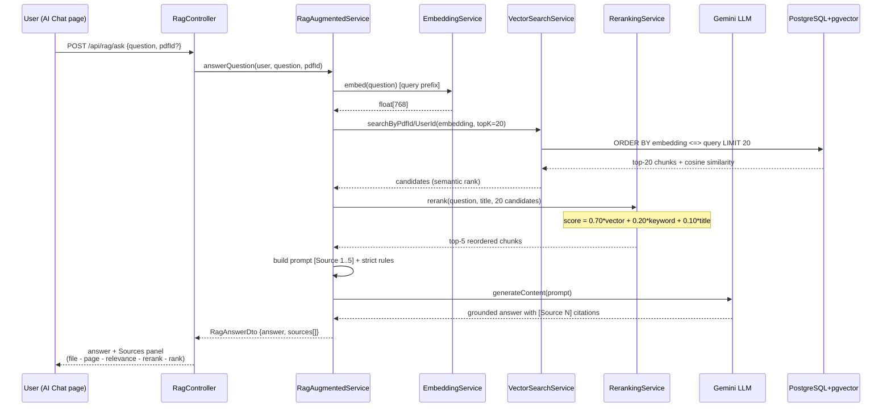
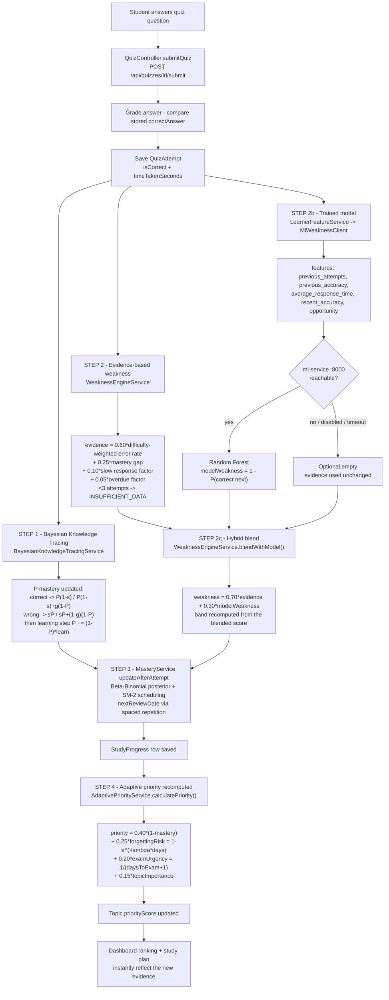
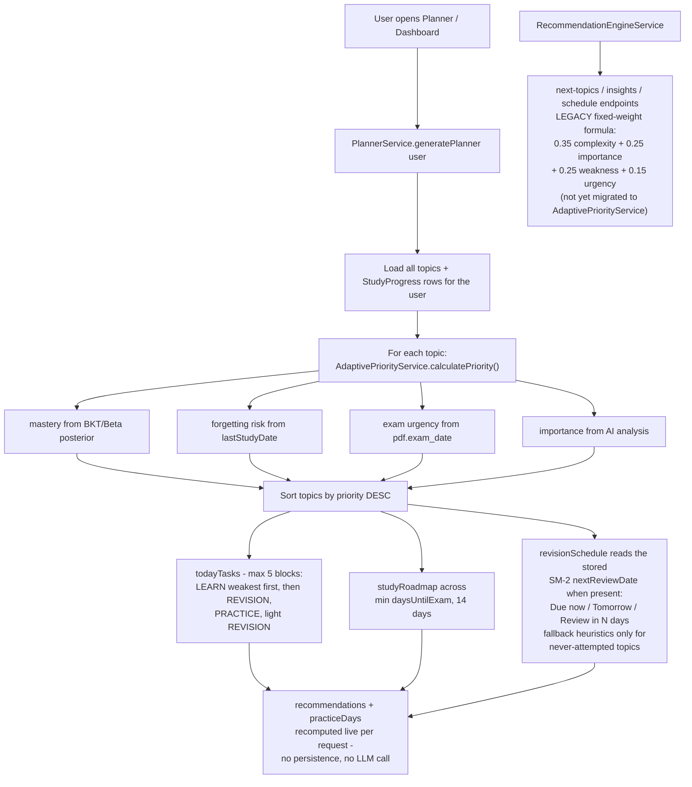

# 🔄 Complete System Workflow — How Everything Works

This document explains **every workflow** in the project step by step, with diagrams,
so you can explain exactly **what happens, where, and why** — including where NLP,
AI/ML, algorithms, chunking, embedding, retrieval, reranking are used.

> Diagrams use [Mermaid](https://mermaid.js.org/) — they render directly in VS Code
> (Markdown Preview Mermaid Support extension) and on GitHub.

---

## 1. High-Level Architecture



**Stack roles:**

| Layer | Technology | Role |
|---|---|---|
| Frontend | React, Vite, Tailwind, Framer Motion | UI, calls `/api/**` with a JWT |
| Backend | Spring Boot 3, Java 17 | All business logic, AI orchestration |
| Database | PostgreSQL + **pgvector** | Relational data **+ vector similarity search** (`<=>`) |
| Docker | `pgvector/pgvector` image | Runs the DB with the `vector` extension available |
| AI #1 | Gemini embedding model | Text → 768-dim vectors |
| AI #2 | Gemini flash models | Topic extraction, quizzes, explanations, RAG answers |
| ML #3 | **Our own** Random Forest (`ml-service`) | Predicts next-answer correctness → 30% of the weakness score |

### 1.1 Account lifecycle (register -> verify -> sign in)

1. **Register** - `POST /api/auth/register` validates the payload, hashes the
   password with BCrypt and stores the user unverified.
2. **E-mail OTP** - an `OtpChallenge` row keeps only a *hash* of the code plus
   purpose, expiry and attempt count; delivery uses SMTP when
   `SMTP_ENABLED=true`, otherwise the code is logged server-side for local
   testing (`OTP_LOG_CODES=true`).
3. **Verify** - `POST /api/auth/verify-email` checks hash + expiry + attempts,
   marks the account verified and returns the first JWT.
4. **Sign in** - `POST /api/auth/login` re-checks credentials and issues a
   fresh 24 h token; every later request carries it as `Bearer`.
5. **Recovery** - forgot/reset reuse the same OTP mechanism with purpose
   `PASSWORD_RESET`; Google sign-in validates the ID token's issuer, audience
   and expiry server-side before issuing a session.

The Profile page's exam-date editor feeds the same trust chain: it calls
`PUT /api/pdfs/{pdfId}/exam-date`, which is ownership-checked, so the urgency
term in Workflow D always uses real data.

---

## 2. Workflow A — PDF Ingestion (one-time per PDF)

This runs **asynchronously** right after upload, so the user never waits.



Chunking and embedding run **before** topic extraction (both live inside the same
`processAsync()` call, sequentially, not in parallel) — so the RAG index exists as soon as
processing finishes, and a student can start asking questions in AI Chat without waiting for
topic/quiz generation to also complete.

### 2.1 Where the NLP is here

| Step | Technique | File |
|---|---|---|
| Text extraction | PDFBox text layer parsing + cleanup | `PdfExtractionService` (called by `PdfManagementService`) |
| Topic segmentation | LLM NLP — Gemini reads up to 100k chars and returns a **structured JSON** of major topics with descriptions, importance (0–1), complexity (0–1) | `GeminiAiService.analyzeContent()` |
| Semantic signals | LLM returns `conceptDensity`, `keywordDifficulty`, `formulaCount`, `length` per topic | parsed into `SemanticSignals` DTO |
| Difficulty scoring | Weighted fusion of those signals: `calculateComplexityScore()` | `ScoringEngineService` |

The prompt asks Gemini for **strict JSON only**, temperature `0.2` (low randomness =
repeatable structure), with a **model fallback chain**: `gemini-2.5-flash` →
`2.0-flash` → `2.5-flash-lite` → `3.1-flash-lite`, plus exponential-backoff retries
on HTTP 429/503.

### 2.2 Chunking algorithm in depth (`TextChunkingService`)

**Why chunk at all?** Embeddings and LLM context are finite, and retrieval works best on
small, self-contained passages. One giant PDF text would make every search return
"the whole document" — useless.

**The algorithm (fixed-window sliding with semantic boundaries):**

| Parameter | Value | Meaning |
|---|---|---|
| `CHUNK_SIZE_CHARS` | 2048 (~512 tokens) | target window size |
| `CHUNK_OVERLAP_CHARS` | 200 | overlap so sentences cut at a boundary still appear fully in the next chunk |
| `MAX_CHUNKS` | 500 | hard safety cap per PDF |

```
loop over text:
    end = start + 2048
    if end is not the end of text:
        prefer breaking at the last "\n\n" (paragraph) before end
        else break at the last ". " (sentence end) before end
        but never earlier than start + 1024 (keeps chunks balanced)
    save substring(start, end)
    if we reached the end of text: stop          <- prevents infinite loop
    next start = end - 200 (overlap), guaranteed to move forward
```

Each chunk also stores an **estimated page number** (`charPosition / 3000 + 1`) —
this is what later appears in citations like *"page 14 — relevance 0.91"*.

### 2.3 Embedding generation in depth (`EmbeddingService`)

An **embedding** is a learned numeric representation of meaning: text → a point in
768-dimensional space. Texts with similar meaning land close together, so "how close
are two texts?" becomes simple vector math (cosine distance).

Key implementation facts (all real code):

- **Model:** `gemini-embedding-001`, **768 dimensions** per vector (via `outputDimensionality`).
- **Asymmetric retrieval prefixes** — queries and documents are formatted differently,
  which measurably improves retrieval quality:
  - question → `"task: question answering | query: <text>"`
  - chunk   → `"title: none | text: <text>"`
- **Batching:** chunks are embedded in batches of **20** per HTTP call (not one request
  per chunk) via `batchEmbedContents`.
- **Robustness:** 3 retry attempts, honors `retry-after`, exponential backoff; validates
  every returned vector has exactly 768 finite non-zero values.
- **Storage format:** vectors are stored as pgvector **text literals**
  (`"[0.012,-0.084,...]"`) in a `TEXT` column and cast to `vector` at query time —
  so no migration was needed when switching from fake to real search.

---

## 3. Workflow B — RAG Question Answering (`POST /api/rag/ask`, AI Chat page)

This is the core **Retrieval-Augmented Generation** pipeline:



### 3.1 Retrieval math (pgvector cosine)

```sql
SELECT ..., 1 - (embedding::vector <=> :queryEmbedding) AS similarity
FROM document_chunks
WHERE pdf_id = :pdfId
ORDER BY embedding::vector <=> :queryEmbedding
LIMIT 20
```

- `<=>` is pgvector's **cosine distance** in [0, 2]; `similarity = 1 − distance` maps it
  to a friendly [−1, 1] score (in practice ~0.4–0.9 for related text).
- Cosine ignores vector magnitude and measures **angle = semantic direction**, the
  standard for text retrieval.
- `searchByUserId` joins `pdf_documents` so a user can **never** retrieve another
  user's chunks (ownership enforced inside the SQL itself).

### 3.2 Reranking in depth (`RerankingService`) — why top-20 → top-5

Vector search is strong but imperfect: a chunk can be *semantically close* yet not
actually answer the question, while the true answer chunk ranks #7. So we **retrieve
generously, then re-score with complementary signals**:

```
rerankScore = 0.70 × vectorSimilarity      // semantic closeness from pgvector
            + 0.20 × keywordOverlap        // % of question terms found in the chunk
            + 0.10 × titleMatch            // topic/title word shared by question AND chunk
```

- **keywordOverlap**: both texts are tokenized (lowercase, `[a-z0-9]+`, ~40 stop words
  removed), then overlap = |question ∩ chunk| / |question|.
- **titleMatch** = 1.0 when any title word appears in *both* question and chunk —
  anchors chunks from the right topical section.
- Weights are explainable: embeddings carry most signal; exact terms catch what
  embeddings miss; title is only a small tie-breaker.
- Only the **top 5** survive into the LLM prompt — better answers *and* cheaper tokens.
- The UI shows both scores per source (`relevance` vs `rerank`), so you can
  **demonstrate that reranking changes the order** live.

> Upgrade path for the report: replace this with a cross-encoder reranker
> (e.g., a local BGE/MiniLM rerank model). The interface (`List<RerankedResult>
> rerank(...)`) already isolates that swap.

### 3.3 Grounded generation (anti-hallucination)

`buildRagPrompt()` enforces hard rules:

1. Answer **only** from the `[Source N]` blocks.
2. Never invent facts/examples/numbers outside CONTEXT.
3. Insufficient evidence ⇒ say so explicitly.
4. **Cite every factual statement** as `[Source N]`.
5. No trailing Sources section (the UI renders real sources from the DB).

Because sources are returned as structured DTOs (not parsed from prose), citations in
the UI are **ground truth from PostgreSQL**, independent of what the LLM writes.

---

## 4. Workflow C — Quiz Taking & the Adaptive Learning Loop

Every quiz submission feeds the algorithm. This is where "ML-like" adaptation happens:



> **Ownership gate:** before grading, `QuizController` verifies
> quiz → topic → `pdf_documents.user_id` against the JWT caller and returns 404
> otherwise. The same guard wraps every topic, dashboard and report route, so
> one student can never read or mutate another student's data.

### 4.1 Mastery and scheduling in depth (`MasteryService`)

Two estimators run on every attempt and are averaged:

```
betaBinomial = α / (α + β)        // α starts 2.0, β starts 8.0  -> prior mean 0.20
                                  // correct: α += 1   incorrect: β += 1
                                  // correct in < 3 s: β += 0.3  (guess penalty)
bkt          = BKT posterior + learning step   (see §6 master map)
mastery      = 0.5·betaBinomial + 0.5·bkt
```

Why both? The Beta-Binomial is a pure frequency count — honest but slow to move
and blind to guessing. BKT models guess/slip explicitly but is sensitive to its
assumed parameters. Averaging them keeps the estimate responsive without letting
either model's bias dominate.

**SM-2 scheduling.** The attempt is scored on SM-2's 0–5 recall scale, where
`q >= 3` means *recalled* and `q < 3` resets the repetition count:

| Attempt | Quality | Effect |
|---|---|---|
| correct, `< 5 s` | `5` | interval grows, EF `+0.10` |
| correct, `< 15 s` | `4` | interval grows, EF unchanged |
| correct, slower | `3` | interval grows, EF `−0.14` |
| incorrect | `1` | reset to 1 day, EF `−0.54` |

```
q < 3   ->  repetitions = 0, interval = 1
q >= 3  ->  n=0: 1 day    n=1: 6 days    n>1: ceil(previousInterval · EF)
EF' = EF + (0.1 − (5−q)(0.08 + (5−q)·0.02)),  floor 1.3
nextReviewDate = today + interval
```

> **A bug that was here, and why it mattered.** The quality mapping previously
> scored a correct-but-slow answer (`>15 s`) as `2` — which SM-2 defines as an
> *incorrect* response. A student answering everything correctly but reading
> carefully was reset to a one-day interval on every single attempt, with the
> ease factor pinned at its 1.3 floor: `intervals = [1,1,1,1,1,1]`. The same
> mapping never produced quality `5`, and since the SM-2 ease term is exactly
> zero at quality `4`, the ease factor could only ever *decrease*. Correct
> answers now map to 3–5 by speed, so the schedule grows as SM-2 intends:
> `[1,6,14,30,59,107]` for that same careful student. `Sm2SchedulingTest`
> (9 cases) pins the contract so it cannot regress.

---

### 4.2 The trained model in the loop (`ml-service`)

This is the step that makes the project's supervised-learning component *live*
rather than an offline notebook result.

**What the model predicts.** Trained on the ASSISTments skill-builder dataset,
it answers one question: *given this learner's practice history on this skill,
will they get the next question right?* Weakness is the complement:

```
modelWeakness = 1 - P(correct on next attempt)
```

**How AASA's data maps onto it.** Each ASSISTments row is one practice
opportunity on one (student, skill) pair. AASA's `quiz_attempts` rows for one
(user, topic) are the direct analogue, so `LearnerFeatureService` rebuilds the
same five features:

| Feature | Built from | No history yet |
|---|---|---|
| `previous_attempts` | `attempts.size()` | `0` |
| `previous_accuracy` | correct ÷ total | `0.5` |
| `average_response_time` | mean `timeTakenSeconds` (nulls and negatives skipped) | `null` |
| `recent_accuracy` | correct ratio over the last 3 attempts | `0.5` |
| `opportunity` | `attempts.size() + 1` | `1` |

`average_response_time` is sent as an explicit JSON `null`, not `0`. The fitted
pipeline begins with `SimpleImputer(strategy="median")`, so a null is filled
from the *training* distribution — a better estimate than any constant, and
importantly not a fake "answered instantly" signal.

**No leakage.** Training used `shift(1)` so a row never saw its own outcome.
Here the guarantee is structural: the features summarise every attempt made *so
far* in order to predict the *next* one, which has not been answered yet.

**The request.** One `POST /predict` carrying a batch of instances:

```jsonc
// request
{"instances": [
  {"previous_attempts": 6.0, "previous_accuracy": 0.1667,
   "average_response_time": 48.0, "recent_accuracy": 0.0, "opportunity": 7.0}
]}
// response
{"predictions": [{"probability_correct": 0.2142, "weakness": 0.7858}],
 "model_version": "random_forest-1.0.0"}
```

**Fail-soft contract.** The model is an *enhancement*, never a dependency. All
of these produce `Optional.empty()` and leave the evidence score untouched:

| Situation | Signal | Result |
|---|---|---|
| `ml.weakness.enabled=false` | — | call skipped entirely |
| Service not running | connection refused | evidence only |
| Service up, no joblib | HTTP `503` | evidence only |
| Slow response | 1.5 s timeout | evidence only |
| Bad/short response body | parse guard | evidence only |

After 3 consecutive failures the client pauses calls for 60 s, so a dead
service costs one timeout rather than one per submission. **A student's answer
can never fail to save because an optional model is down.**

> **Verify it is actually live** — the fallback is silent by design, so
> "the app works" does not prove "the model is running":
> ```
> curl localhost:9096/api/health
> {"status":"UP","weaknessModel":"live",
>  "weaknessScoring":"hybrid (0.70 evidence + 0.30 model)", ...}
> ```
> `unavailable` means enabled but unreachable; `disabled` means switched off.
> The backend log prints the split for every submission:
> `Evidence: 0.7232, Model: 0.7858, Hybrid: 0.7420`.

**Two deliberate non-blends.** A `NOT_ATTEMPTED` topic keeps weakness `1.0`
rather than being blended down — with no history the model's inputs are all
defaults, so mixing it in would dilute the "never studied = study first" signal
without adding information. `INSUFFICIENT_DATA` blends its score but keeps its
band, because that band reports how much *evidence* exists, not how weak the
learner is.

---

## 5. Workflow D — Study Plan & Recommendation Generation

This is where the algorithm's output becomes something the student actually sees.



**Why this is "adaptive":** the same quiz submission from Workflow C instantly changes
the ordering here. Score badly on *OSI Model* → mastery drops → forgetting risk rises →
priority rises → tomorrow's plan puts OSI first. Nothing is hardcoded per topic.

### 5.1 Companion endpoint — study report (`GET /api/reports/study-report`)

`ReportService` aggregates the same evidence (quiz attempts, `StudyProgress`,
ranked topics) into `{summary, topicBreakdown[], recommendations[]}` for the
Reports page, which exports it as JSON or CSV. The route is read-only,
ownership-scoped like every other endpoint, and needs no AI call.

---

## 6. Master Map — Where Every Technique Lives

Use this table to answer *"where is X used?"* instantly.

| Technique | What it does here | Exact location | Workflow |
|---|---|---|---|
| **NLP — text extraction** | Reads the PDF text layer | `PdfExtractionService` (Apache PDFBox) | A |
| **NLP — LLM information extraction** | Topics, descriptions, importance, complexity as structured JSON | `GeminiAiService.analyzeContent()` | A |
| **Chunking** | ~512-token windows with overlap, cut at paragraph/sentence boundaries | `TextChunkingService.chunkDocument()` | A |
| **Embedding (ML)** | Text → 768-dim dense vectors (Gemini embedding model), batched 20-at-a-time | `EmbeddingService` | A |
| **Vector database** | Stores embeddings + cosine-distance search operator `<=>` | PostgreSQL **pgvector**, `document_chunks.embedding` | B |
| **Semantic retrieval** | `similarity = 1 − (embedding::vector <=> query)` top-20 candidates | `VectorSearchService` | B |
| **Reranking (hybrid IR)** | `0.70·vector + 0.20·keywordOverlap + 0.10·titleMatch`, top-20 → top-5 | `RerankingService` | B |
| **Prompt engineering / grounding** | Anti-hallucination rules + mandatory `[Source N]` citations | `RagAugmentedService.buildRagPrompt()` | B |
| **RAG generation** | Answer synthesis strictly from retrieved context | `GeminiAiService` via `RagAugmentedService.answerQuestion()` | B |
| **Bayesian Knowledge Tracing (algorithm)** | P(mastery) update per answer; guess `0.20`, slip `0.10`, learn `0.40` correct / `0.15` incorrect | `BayesianKnowledgeTracingService.updateMastery()` | C |
| **Forgetting curve (algorithm)** | `risk = 1 − e^(−λ·days)`, `λ = 0.15·(1.6 − mastery)` | `BayesianKnowledgeTracingService.forgettingRisk()` | C |
| **Mastery fusion** | `0.5·BetaBinomial + 0.5·BKT` — two estimators averaged per attempt | `MasteryService.updateAfterAttempt()` | C |
| **Guess penalty (heuristic)** | `β += 0.3` when an answer is correct in under 3 s | `MasteryService.updateBayesianMastery()` | C |
| **Evidence-based weakness (statistical model)** | Difficulty-weighted error rate + mastery gap + response time + overdue factor | `WeaknessEngineService.calculateEvidenceBasedWeakness()` | C |
| **Supervised ML — next-answer prediction (live)** | Random Forest returns `P(correct)`; `weakness = 1 − P(correct)` | `ml/serve.py` via `MlWeaknessClient` | C |
| **Feature engineering for the model** | Attempt history → the 5 columns the classifier was fitted on, leakage-safe | `LearnerFeatureService.extract()` | C |
| **Hybrid weakness fusion** | `0.70·evidence + 0.30·model`, degrading to evidence alone when the model is unavailable | `WeaknessEngineService.blendWithModel()` | C |
| **Beta-Binomial posterior (Bayesian stats)** | Success/failure counts → probability distribution of true ability | `MasteryService` | C |
| **SM-2 spaced repetition (classic algorithm)** | Interval growth `1 → 6 → ceil(prev·EF)`; quality `5/4/3` for correct by speed, `1` for incorrect; EF floor `1.3` | `MasteryService.applySm2()` (nextReviewDate) | C |
| **Content scoring (heuristic fusion)** | `complexity = 0.4·density + 0.3·difficulty + 0.2·formulas + 0.1·length`; importance fallback `0.6/0.4` | `ScoringEngineService`, `TopicAnalysisService` | A |
| **Ownership / multi-tenant isolation** | Every ID route verifies resource ↔ caller; retrieval SQL joins `pdf_documents` on the owner | All controllers, `VectorSearchService` | A–E |
| **Report aggregation** | Summary + topic breakdown + mastery-based recommendations → JSON/CSV export | `ReportController`, `ReportService` | D |
| **Weakness-model training (CRISP-DM)** | scikit-learn experiment producing `weakness_model.joblib`; student-wise split, F1 0.734 / ROC-AUC 0.705 on held-out test | `ml/train_model.py` (offline) | — |
| **Adaptive priority fusion (algorithm)** | Weighted combination of the four *computed* signals | `AdaptivePriorityService.calculatePriority()` | C→D |
| **Greedy scheduling** | Fill daily budget highest-priority-first | `PlannerService` | D |
| **Legacy fixed-weight ranking** ⚠ | Still ranks `/api/recommendations/**` (Study page "next topics") on complexity/importance/weakness/urgency — *superseded by adaptive priority, migration outstanding* | `RecommendationEngineService.calculateRecommendationScore()` | D |

### 6.1 The four AI/ML categories in one sentence each

1. **Classic ML representation learning** — the Gemini *embedding model* turns text into
   vectors where semantic similarity = geometric closeness (cosine). This is learned
   language representation, i.e., real ML.
2. **Generative AI / NLP** — Gemini flash models do the *language understanding*
   (topic extraction, quiz authoring, explanations) and *generation* (RAG answers).
3. **Probabilistic user modeling (our contribution)** — BKT, Beta-Binomial, forgetting
   curves, and evidence-weighted weakness are Bayesian/statistical algorithms running
   **locally in Java** — no API call, deterministic, unit-tested, explainable.
4. **Supervised learning we trained ourselves (our contribution)** — a Random Forest
   fitted on ~283k real practice opportunities predicts next-answer correctness; it
   runs on our own infrastructure (`ml-service`, no external API, no per-call cost)
   and contributes 30% of every weakness score. Categories 1–2 are *bought*
   intelligence; 3–4 are *built* intelligence, and 4 is the only one that learned its
   parameters from data rather than having them chosen by us.

---

## 7. End-to-End Trace — One Question Through the System

Concrete walkthrough of *"Explain the OSI model"* asked on the AI Chat page:

```
1. React AiChat.jsx        POST /api/rag/ask {question, pdfId} + JWT header
2. RagController           validates user -> ragAugmentedService.answerQuestion()
3. EmbeddingService        "Explain the OSI model" -> Gemini embedding API
                           -> [0.021, -0.113, ..., 0.087]   (768 floats)
4. VectorSearchService     SQL: ORDER BY embedding::vector <=> query LIMIT 20
                           -> 20 chunks, each with cosine similarity 0..1
                              e.g. chunk#41 p.14 sim=0.83, chunk#39 p.13 sim=0.81,
                                   chunk#12 p.5  sim=0.44 ...
5. RerankingService        tokenizes question -> {osi, model}
                           rerankScore = 0.70*sim + 0.20*overlap + 0.10*title
                           chunk#41: 0.70*0.83 + 0.20*0.50 + 0.10*1.00 = 0.791
                           chunk#39: 0.70*0.81 + 0.20*0.25 + 0.10*1.00 = 0.742
                           ... sort DESC -> keep top 5
6. buildRagPrompt          "[Source 1] <chunk41> ... [Source 5] <chunk17>"
                           + grounding rules
7. GeminiAiService         generates answer with [Source N] markers only from context
8. Response DTO            RagAnswerDto {answer, sources[5]}
                           each source: page, text preview, similarity,
                           rerankScore, rank, retrievalRank
9. React                   renders answer + Sources panel:
                           "Lecture_notes.pdf — page 14 — relevance 0.83 · rerank 0.79 · rank #1"
```

**Demonstration point:** if reranking changed nothing, `rank == retrievalRank` for every
source. When they differ (e.g. `retrievalRank: 7` at `rank: 1`), you have live proof that
the reranker reorders retrieval.

---

## 8. Worked Numeric Example — The Adaptive Algorithm

One student, topic *OSI Model*, exam in 9 days, AI importance = 0.8.

**Start:** P(mastery) = 0.30 (prior from topic creation).

**Attempt 1 — answers correctly** (guess g=0.20, slip s=0.10):

```
P(obs) = (1-s)*P / ((1-s)*P + g*(1-P))
       = 0.9*0.30 / (0.9*0.30 + 0.20*0.70)
       = 0.27 / 0.41 = 0.659

learning step:  P = 0.659 + (1-0.659)*0.40 = 0.795
```
One correct answer moved mastery 0.30 → 0.80 — but not to 1.0, because a lucky guess is possible.

**Attempt 2 next week — answered wrong:**
```
P(obs) = s*P / (s*P + (1-g)*(1-P)) = 0.10*0.795 / (0.0795 + 0.80*0.205)
       = 0.0795 / 0.2435 = 0.326
learning-from-feedback: P = 0.326 + 0.674*0.15 = 0.427
```
Mastery falls — but doesn't crash, because even strong students *slip* sometimes.

**Forgetting risk** 7 days later with mastery 0.427:
```
lambda = 0.15 * (1.6 - 0.427) = 0.176
risk = 1 - e^(-0.176 * 7) = 1 - e^-1.232 = 0.708
```
Weak knowledge decays fast: 71% chance the material is forgotten after a week.

**Adaptive priority:**
```
priority = 0.40*(1 - 0.427)      // mastery gap        = 0.229
         + 0.25*0.708            // forgetting risk    = 0.177
         + 0.20*(1/(9+1))        // exam urgency       = 0.020
         + 0.15*0.8              // importance         = 0.120
         ------------------------------------------   --------
         = 0.55                                       HIGH -> study soon
```

**Hybrid weakness** for the same topic, after 6 attempts with 1 correct
(avg 48 s, last three all wrong):

```
evidence  = 0.60*(5/6)            // difficulty-weighted error rate = 0.500
          + 0.25*(1 - 0.427)      // mastery gap                    = 0.143
          + 0.10*min(48/60, 1)    // slow-response factor           = 0.080
          + 0.05*0                // not overdue                    = 0.000
          = 0.7232

model     -> POST /predict {previous_attempts: 6, previous_accuracy: 0.1667,
                            average_response_time: 48, recent_accuracy: 0,
                            opportunity: 7}
          <- {"probability_correct": 0.2142, "weakness": 0.7858}

hybrid    = 0.70*0.7232 + 0.30*0.7858 = 0.7420   -> band HIGH
```

The model is *more* pessimistic than the heuristic here (0.786 vs 0.723): three
consecutive failures at 48 s each is a pattern it has seen thousands of times,
and it pulls the final score up. Had the model been unreachable, the score would
simply have stayed `0.7232` — same band, no error, nothing for the student to
notice.

Every number here is produced by code you can open and explain:
`BayesianKnowledgeTracingService` (steps 1–3), `AdaptivePriorityService` (step 4),
and `WeaknessEngineService` + `ml/serve.py` (the hybrid step). The prediction
above is a real response from the running service, not an illustration.

---

## 9. Viva Cheat Sheet — Likely Questions & 30-Second Answers

**"Isn't this just a weighted formula?"**
> No. The weights combine four signals that are each *computed by an algorithm from data*:
> mastery comes from Bayesian inference over real quiz answers, forgetting risk from an
> exponential time-decay model, urgency from the exam date, importance from NLP analysis.
> A static weighted formula would score the same forever; ours changes after every attempt.

**"Where exactly is machine learning?"**
> Three places. (1) The embedding model is a learned neural language representation —
> text becomes 768-dim vectors where meaning maps to geometry. (2) The LLM performs
> NLP extraction and grounded generation. (3) **A Random Forest we trained ourselves**
> on 283k ASSISTments practice opportunities predicts whether the student will answer
> the next question correctly; `1 − P(correct)` is 30% of every weakness score. The
> first two are external APIs; the third runs on our own service with no API cost.
> On top of all that sits probabilistic learner modeling (BKT, Beta-Binomial,
> forgetting curves) in Java.

**"Is the trained model actually used, or just a notebook result?"**
> Actually used. Every graded quiz attempt calls it: `LearnerFeatureService` rebuilds
> the five training features from the student's attempt history, `MlWeaknessClient`
> POSTs them to `ml-service`, and the returned weakness is blended
> `0.70·evidence + 0.30·model`. `GET /api/health` reports `weaknessModel: live`, and
> the backend logs the evidence/model/hybrid split for every submission. Six opt-in
> integration tests (`ML_INTEGRATION_TEST=true`) exercise the real service end to end.

**"What happens if the model service goes down mid-demo?"**
> Nothing visible. Every failure path — disabled, refused, timeout, HTTP 503 from a
> service with no artifact, malformed body — returns an empty Optional and the
> evidence formula stands alone, which is exactly the behaviour the system had before
> the model existed. After three consecutive failures the client stops calling for
> 60 s so a dead service costs one timeout, not one per submission. That is a design
> choice: a student's answer must never fail to save because an optional model is
> unavailable.

**"Why weight the model only 0.30?"**
> Two reasons. It was trained on ASSISTments — a different population from our users —
> so it transfers a general "practice history → next-answer correctness" signal rather
> than course-specific knowledge. And the evidence term is fully explainable, which
> matters for a study tool that must justify why it tells a student to revise
> something. The learned correction improves the ranking; it does not take it over.

**"How does chunking work and why?"**
> ~512-token windows with overlap, cut on paragraph/sentence boundaries so ideas stay
> intact. Overlap prevents an idea split across a boundary from being lost; 512 tokens
> balances semantic completeness against retrieval precision.

**"Why retrieve 20 chunks if the LLM only gets 5?"**
> Recall/precision trade-off: vector search casts a wide net (high recall), the hybrid
> reranker then promotes the chunks that truly answer the question (precision). Feeding
> only 5 also keeps prompts cheap and focused.

**"How do you stop the LLM hallucinating?"**
> Strict prompt rules (only context, cite every claim, refuse when evidence is short),
> plus citations shown in the UI come from PostgreSQL rows, not from the model's prose.

**"What did YOU build vs. what does the API give you?"**
> The API provides raw intelligence (embeddings, generation). We built the entire
> pipeline around it: chunking strategy, vector schema + ownership-safe cosine SQL,
> the hybrid reranker, grounding/citation design, BKT mastery estimation, the
> forgetting-curve scheduler, adaptive priority fusion, greedy plan generation —
> plus the weakness classifier, which we trained, served and wired in ourselves.
> All tested: 64 tests across 12 suites, including two opt-in integration suites
> (live pgvector retrieval, `RAG_INTEGRATION_TEST=true`; live model inference,
> `ML_INTEGRATION_TEST=true`) whose 9 cases skip by default.

**"How do you know one student can't see another's data?"**
> Every controller resolves the caller from the JWT and verifies that the
> requested topic, quiz, PDF or report belongs to them before touching it
> (404 otherwise). Vector retrieval SQL itself joins `pdf_documents` on the
> owner, uploads replace only the caller's rows, and no shared default
> account exists anymore.

---

*End of workflow document. Pair it with `ARCHITECTURE.md` (system view)
and `docs/schema.sql` (database bootstrap DDL).*


