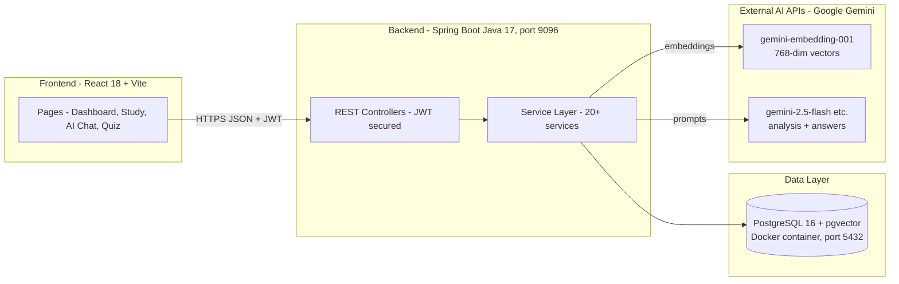
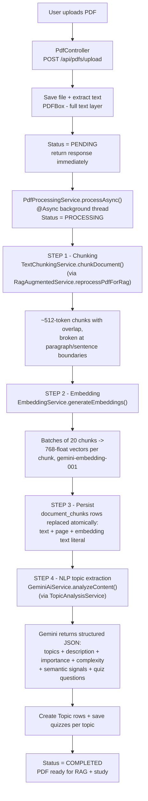
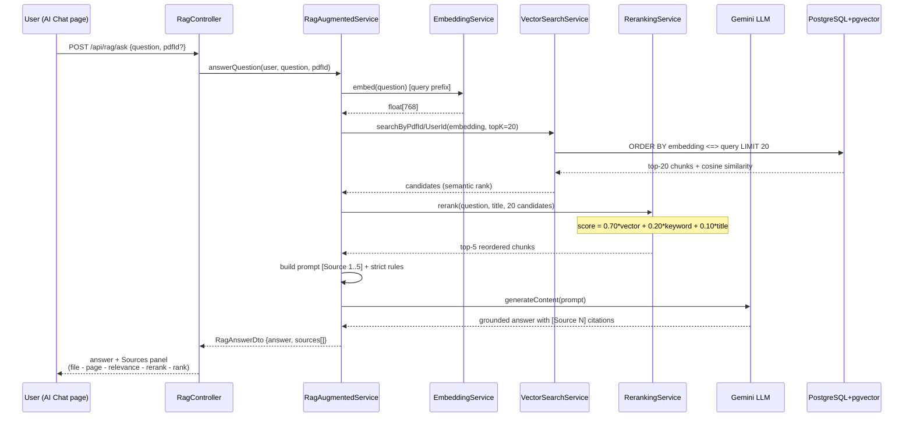
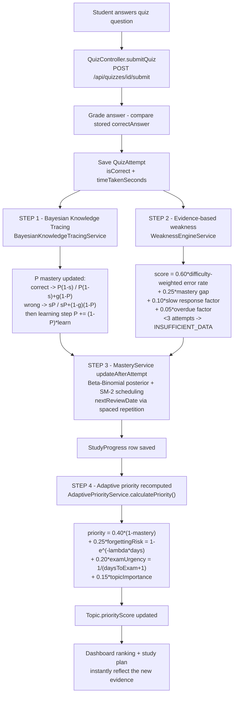
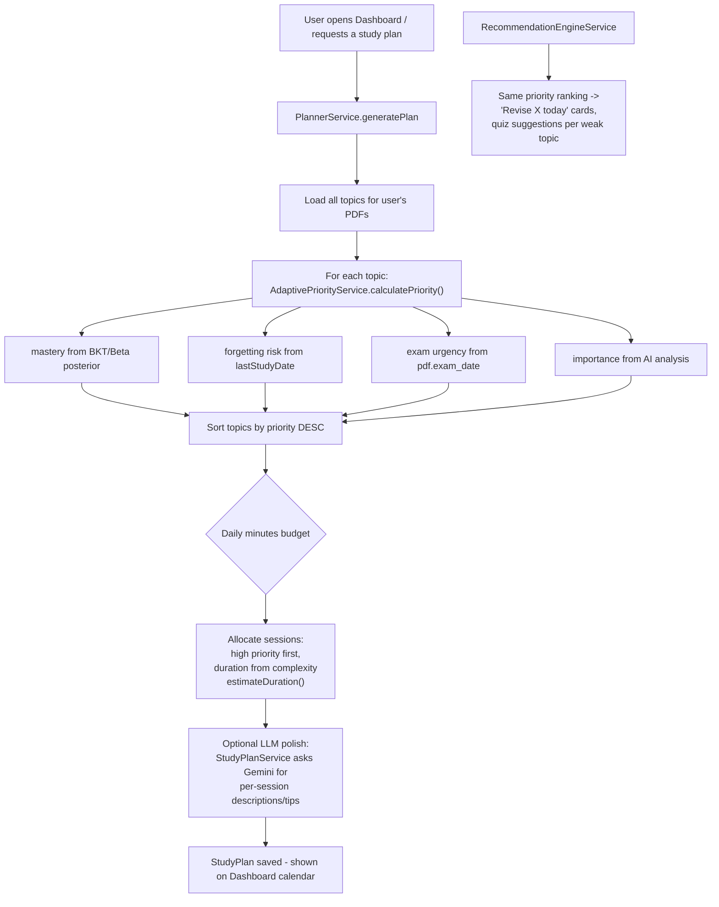

# 🔄 Complete System Workflow — How Everything Works

This document explains **every workflow** in the project step by step, with diagrams,
so you can explain exactly **what happens, where, and why** — including where NLP,
AI/ML, algorithms, chunking, embedding, retrieval, reranking are used.

> Diagrams use [Mermaid](https://mermaid.js.org/) — they render directly in VS Code
> (Markdown Preview Mermaid Support extension) and on GitHub.

---

## 1. High-Level Architecture



**Stack roles:**

| Layer | Technology | Role |
|---|---|---|
| Frontend | React, Vite, Tailwind, Framer Motion | UI, calls `/api/**` with a JWT |
| Backend | Spring Boot 3, Java 17 | All business logic, AI orchestration |
| Database | PostgreSQL + **pgvector** | Relational data **+ vector similarity search** (`<=>`) |
| Docker | `pgvector/pgvector` image | Runs the DB with the `vector` extension available |
| AI #1 | Gemini embedding model | Text → 768-dim vectors |
| AI #2 | Gemini flash models | Topic extraction, quizzes, explanations, RAG answers |

---

## 2. Workflow A — PDF Ingestion (one-time per PDF)

This runs **asynchronously** right after upload, so the user never waits.



Chunking and embedding run **before** topic extraction (both live inside the same
`processAsync()` call, sequentially, not in parallel) — so the RAG index exists as soon as
processing finishes, and a student can start asking questions in AI Chat without waiting for
topic/quiz generation to also complete.

### 2.1 Where the NLP is here

| Step | Technique | File |
|---|---|---|
| Text extraction | PDFBox text layer parsing | `PdfManagementService` |
| Topic segmentation | LLM NLP — Gemini reads up to 100k chars and returns a **structured JSON** of major topics with descriptions, importance (0–1), complexity (0–1) | `GeminiAiService.analyzeContent()` |
| Semantic signals | LLM returns `conceptDensity`, `keywordDifficulty`, `formulaCount`, `length` per topic | parsed into `SemanticSignals` DTO |
| Difficulty scoring | Weighted fusion of those signals: `calculateComplexityScore()` | `ScoringEngineService` |

The prompt asks Gemini for **strict JSON only**, temperature `0.2` (low randomness =
repeatable structure), with a **model fallback chain**: `gemini-2.5-flash` →
`2.0-flash` → `2.5-flash-lite` → `3.1-flash-lite`, plus exponential-backoff retries
on HTTP 429/503.

### 2.2 Chunking algorithm in depth (`TextChunkingService`)

**Why chunk at all?** Embeddings and LLM context are finite, and retrieval works best on
small, self-contained passages. One giant PDF text would make every search return
"the whole document" — useless.

**The algorithm (fixed-window sliding with semantic boundaries):**

| Parameter | Value | Meaning |
|---|---|---|
| `CHUNK_SIZE_CHARS` | 2048 (~512 tokens) | target window size |
| `CHUNK_OVERLAP_CHARS` | 200 | overlap so sentences cut at a boundary still appear fully in the next chunk |
| `MAX_CHUNKS` | 500 | hard safety cap per PDF |

```
loop over text:
    end = start + 2048
    if end is not the end of text:
        prefer breaking at the last "\n\n" (paragraph) before end
        else break at the last ". " (sentence end) before end
        but never earlier than start + 1024 (keeps chunks balanced)
    save substring(start, end)
    if we reached the end of text: stop          <- prevents infinite loop
    next start = end - 200 (overlap), guaranteed to move forward
```

Each chunk also stores an **estimated page number** (`charPosition / 3000 + 1`) —
this is what later appears in citations like *"page 14 — relevance 0.91"*.

### 2.3 Embedding generation in depth (`EmbeddingService`)

An **embedding** is a learned numeric representation of meaning: text → a point in
768-dimensional space. Texts with similar meaning land close together, so "how close
are two texts?" becomes simple vector math (cosine distance).

Key implementation facts (all real code):

- **Model:** `gemini-embedding-001`, **768 dimensions** per vector (via `outputDimensionality`).
- **Asymmetric retrieval prefixes** — queries and documents are formatted differently,
  which measurably improves retrieval quality:
  - question → `"task: question answering | query: <text>"`
  - chunk   → `"title: none | text: <text>"`
- **Batching:** chunks are embedded in batches of **20** per HTTP call (not one request
  per chunk) via `batchEmbedContents`.
- **Robustness:** 3 retry attempts, honors `retry-after`, exponential backoff; validates
  every returned vector has exactly 768 finite non-zero values.
- **Storage format:** vectors are stored as pgvector **text literals**
  (`"[0.012,-0.084,...]"`) in a `TEXT` column and cast to `vector` at query time —
  so no migration was needed when switching from fake to real search.

---

## 3. Workflow B — RAG Question Answering (`POST /api/rag/ask`, AI Chat page)

This is the core **Retrieval-Augmented Generation** pipeline:



### 3.1 Retrieval math (pgvector cosine)

```sql
SELECT ..., 1 - (embedding::vector <=> :queryEmbedding) AS similarity
FROM document_chunks
WHERE pdf_id = :pdfId
ORDER BY embedding::vector <=> :queryEmbedding
LIMIT 20
```

- `<=>` is pgvector's **cosine distance** in [0, 2]; `similarity = 1 − distance` maps it
  to a friendly [−1, 1] score (in practice ~0.4–0.9 for related text).
- Cosine ignores vector magnitude and measures **angle = semantic direction**, the
  standard for text retrieval.
- `searchByUserId` joins `pdf_documents` so a user can **never** retrieve another
  user's chunks (ownership enforced inside the SQL itself).

### 3.2 Reranking in depth (`RerankingService`) — why top-20 → top-5

Vector search is strong but imperfect: a chunk can be *semantically close* yet not
actually answer the question, while the true answer chunk ranks #7. So we **retrieve
generously, then re-score with complementary signals**:

```
rerankScore = 0.70 × vectorSimilarity      // semantic closeness from pgvector
            + 0.20 × keywordOverlap        // % of question terms found in the chunk
            + 0.10 × titleMatch            // topic/title word shared by question AND chunk
```

- **keywordOverlap**: both texts are tokenized (lowercase, `[a-z0-9]+`, ~40 stop words
  removed), then overlap = |question ∩ chunk| / |question|.
- **titleMatch** = 1.0 when any title word appears in *both* question and chunk —
  anchors chunks from the right topical section.
- Weights are explainable: embeddings carry most signal; exact terms catch what
  embeddings miss; title is only a small tie-breaker.
- Only the **top 5** survive into the LLM prompt — better answers *and* cheaper tokens.
- The UI shows both scores per source (`relevance` vs `rerank`), so you can
  **demonstrate that reranking changes the order** live.

> Upgrade path for the report: replace this with a cross-encoder reranker
> (e.g., a local BGE/MiniLM rerank model). The interface (`List<RerankedResult>
> rerank(...)`) already isolates that swap.

### 3.3 Grounded generation (anti-hallucination)

`buildRagPrompt()` enforces hard rules:

1. Answer **only** from the `[Source N]` blocks.
2. Never invent facts/examples/numbers outside CONTEXT.
3. Insufficient evidence ⇒ say so explicitly.
4. **Cite every factual statement** as `[Source N]`.
5. No trailing Sources section (the UI renders real sources from the DB).

Because sources are returned as structured DTOs (not parsed from prose), citations in
the UI are **ground truth from PostgreSQL**, independent of what the LLM writes.

---

## 4. Workflow C — Quiz Taking & the Adaptive Learning Loop

Every quiz submission feeds the algorithm. This is where "ML-like" adaptation happens:



---

## 5. Workflow D — Study Plan & Recommendation Generation

This is where the algorithm's output becomes something the student actually sees.



**Why this is "adaptive":** the same quiz submission from Workflow C instantly changes
the ordering here. Score badly on *OSI Model* → mastery drops → forgetting risk rises →
priority rises → tomorrow's plan puts OSI first. Nothing is hardcoded per topic.

---

## 6. Master Map — Where Every Technique Lives

Use this table to answer *"where is X used?"* instantly.

| Technique | What it does here | Exact location | Workflow |
|---|---|---|---|
| **NLP — text extraction** | Reads the PDF text layer | `PdfManagementService` (Apache PDFBox) | A |
| **NLP — LLM information extraction** | Topics, descriptions, importance, complexity as structured JSON | `GeminiAiService.analyzeContent()` | A |
| **Chunking** | ~512-token windows with overlap, cut at paragraph/sentence boundaries | `TextChunkingService.chunkDocument()` | A |
| **Embedding (ML)** | Text → 768-dim dense vectors (Gemini embedding model), batched 20-at-a-time | `EmbeddingService` | A |
| **Vector database** | Stores embeddings + cosine-distance search operator `<=>` | PostgreSQL **pgvector**, `document_chunks.embedding` | B |
| **Semantic retrieval** | `similarity = 1 − (embedding::vector <=> query)` top-20 candidates | `VectorSearchService` | B |
| **Reranking (hybrid IR)** | `0.70·vector + 0.20·keywordOverlap + 0.10·titleMatch`, top-20 → top-5 | `RerankingService` | B |
| **Prompt engineering / grounding** | Anti-hallucination rules + mandatory `[Source N]` citations | `RagAugmentedService.buildRagPrompt()` | B |
| **RAG generation** | Answer synthesis strictly from retrieved context | `GeminiAiService` via `RagAugmentedService.answerQuestion()` | B |
| **Bayesian Knowledge Tracing (algorithm)** | P(mastery) update per answer with guess/slip/learn parameters | `BayesianKnowledgeTracingService.updateMastery()` | C |
| **Forgetting curve (algorithm)** | `risk = 1 − e^(−λ·days)`, λ scaled by `(1.6 − mastery)` | `BayesianKnowledgeTracingService.forgettingRisk()` | C |
| **Evidence-based weakness (statistical model)** | Difficulty-weighted error rate + mastery gap + response time + overdue factor | `WeaknessEngineService` | C |
| **Beta-Binomial posterior (Bayesian stats)** | Success/failure counts → probability distribution of true ability | `MasteryService` | C |
| **SM-2 spaced repetition (classic algorithm)** | Interval growth 1→6→days×EF based on quality | `MasteryService` (nextReviewDate) | C |
| **Adaptive priority fusion (algorithm)** | Weighted combination of the four *computed* signals | `AdaptivePriorityService.calculatePriority()` | C→D |
| **Greedy scheduling** | Fill daily budget highest-priority-first | `PlannerService` | D |

### 6.1 The three AI/ML categories in one sentence each

1. **Classic ML representation learning** — the Gemini *embedding model* turns text into
   vectors where semantic similarity = geometric closeness (cosine). This is learned
   language representation, i.e., real ML.
2. **Generative AI / NLP** — Gemini flash models do the *language understanding*
   (topic extraction, quiz authoring, explanations) and *generation* (RAG answers).
3. **Probabilistic user modeling (our contribution)** — BKT, Beta-Binomial, forgetting
   curves, and evidence-weighted weakness are Bayesian/statistical algorithms running
   **locally in Java** — no API call, deterministic, unit-tested, explainable.

---

## 7. End-to-End Trace — One Question Through the System

Concrete walkthrough of *"Explain the OSI model"* asked on the AI Chat page:

```
1. React AiChat.jsx        POST /api/rag/ask {question, pdfId} + JWT header
2. RagController           validates user -> ragAugmentedService.answerQuestion()
3. EmbeddingService        "Explain the OSI model" -> Gemini embedding API
                           -> [0.021, -0.113, ..., 0.087]   (768 floats)
4. VectorSearchService     SQL: ORDER BY embedding::vector <=> query LIMIT 20
                           -> 20 chunks, each with cosine similarity 0..1
                              e.g. chunk#41 p.14 sim=0.83, chunk#39 p.13 sim=0.81,
                                   chunk#12 p.5  sim=0.44 ...
5. RerankingService        tokenizes question -> {osi, model}
                           rerankScore = 0.70*sim + 0.20*overlap + 0.10*title
                           chunk#41: 0.70*0.83 + 0.20*0.50 + 0.10*1.00 = 0.791
                           chunk#39: 0.70*0.81 + 0.20*0.25 + 0.10*1.00 = 0.742
                           ... sort DESC -> keep top 5
6. buildRagPrompt          "[Source 1] <chunk41> ... [Source 5] <chunk17>"
                           + grounding rules
7. GeminiAiService         generates answer with [Source N] markers only from context
8. Response DTO            RagAnswerDto {answer, sources[5]}
                           each source: page, text preview, similarity,
                           rerankScore, rank, retrievalRank
9. React                   renders answer + Sources panel:
                           "Lecture_notes.pdf — page 14 — relevance 0.83 · rerank 0.79 · rank #1"
```

**Demonstration point:** if reranking changed nothing, `rank == retrievalRank` for every
source. When they differ (e.g. `retrievalRank: 7` at `rank: 1`), you have live proof that
the reranker reorders retrieval.

---

## 8. Worked Numeric Example — The Adaptive Algorithm

One student, topic *OSI Model*, exam in 9 days, AI importance = 0.8.

**Start:** P(mastery) = 0.30 (prior from topic creation).

**Attempt 1 — answers correctly** (guess g=0.20, slip s=0.10):

```
P(obs) = (1-s)*P / ((1-s)*P + g*(1-P))
       = 0.9*0.30 / (0.9*0.30 + 0.20*0.70)
       = 0.27 / 0.41 = 0.659

learning step:  P = 0.659 + (1-0.659)*0.40 = 0.795
```
One correct answer moved mastery 0.30 → 0.80 — but not to 1.0, because a lucky guess is possible.

**Attempt 2 next week — answered wrong:**
```
P(obs) = s*P / (s*P + (1-g)*(1-P)) = 0.10*0.795 / (0.0795 + 0.80*0.205)
       = 0.0795 / 0.2435 = 0.326
learning-from-feedback: P = 0.326 + 0.674*0.15 = 0.427
```
Mastery falls — but doesn't crash, because even strong students *slip* sometimes.

**Forgetting risk** 7 days later with mastery 0.427:
```
lambda = 0.15 * (1.6 - 0.427) = 0.176
risk = 1 - e^(-0.176 * 7) = 1 - e^-1.232 = 0.708
```
Weak knowledge decays fast: 71% chance the material is forgotten after a week.

**Adaptive priority:**
```
priority = 0.40*(1 - 0.427)      // mastery gap        = 0.229
         + 0.25*0.708            // forgetting risk    = 0.177
         + 0.20*(1/(9+1))        // exam urgency       = 0.020
         + 0.15*0.8              // importance         = 0.120
         ------------------------------------------   --------
         = 0.55                                       HIGH -> study soon
```

Every number here is produced by code you can open and explain:
`BayesianKnowledgeTracingService` (steps 1–3) and `AdaptivePriorityService` (step 4).

---

## 9. Viva Cheat Sheet — Likely Questions & 30-Second Answers

**"Isn't this just a weighted formula?"**
> No. The weights combine four signals that are each *computed by an algorithm from data*:
> mastery comes from Bayesian inference over real quiz answers, forgetting risk from an
> exponential time-decay model, urgency from the exam date, importance from NLP analysis.
> A static weighted formula would score the same forever; ours changes after every attempt.

**"Where exactly is machine learning?"**
> Two places: (1) the embedding model is a learned neural language representation —
> text becomes 768-dim vectors where meaning maps to geometry; (2) the LLM performs
> NLP extraction and grounded generation. On top of that we add probabilistic
> learner modeling (BKT, Beta-Binomial, forgetting curves) running locally.

**"How does chunking work and why?"**
> ~512-token windows with overlap, cut on paragraph/sentence boundaries so ideas stay
> intact. Overlap prevents an idea split across a boundary from being lost; 512 tokens
> balances semantic completeness against retrieval precision.

**"Why retrieve 20 chunks if the LLM only gets 5?"**
> Recall/precision trade-off: vector search casts a wide net (high recall), the hybrid
> reranker then promotes the chunks that truly answer the question (precision). Feeding
> only 5 also keeps prompts cheap and focused.

**"How do you stop the LLM hallucinating?"**
> Strict prompt rules (only context, cite every claim, refuse when evidence is short),
> plus citations shown in the UI come from PostgreSQL rows, not from the model's prose.

**"What did YOU build vs. what does the API give you?"**
> The API provides raw intelligence (embeddings, generation). We built the entire
> pipeline around it: chunking strategy, vector schema + ownership-safe cosine SQL,
> the hybrid reranker, grounding/citation design, BKT mastery estimation, the
> forgetting-curve scheduler, adaptive priority fusion, greedy plan generation —
> all tested (34 tests incl. a live pgvector integration test).

---

*End of workflow document. Pair it with `ARCHITECTURE.md` (system view),
`PROJECT_DOCUMENTATION.md` (full reference), and `EVALUATION.md` (results table).*


